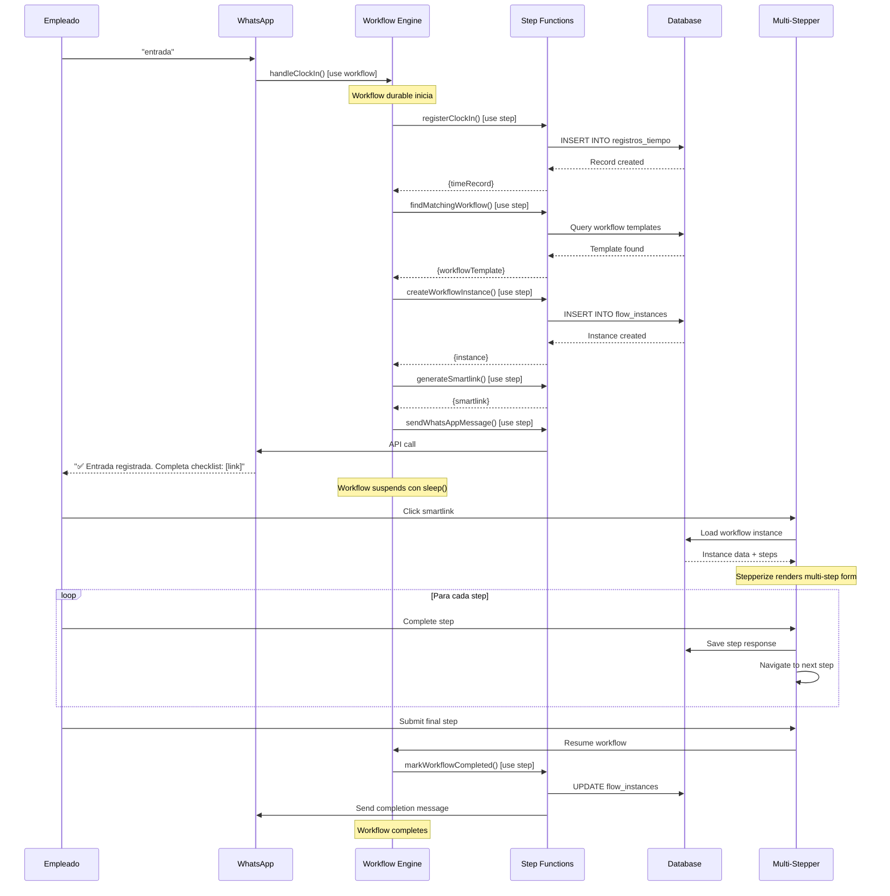
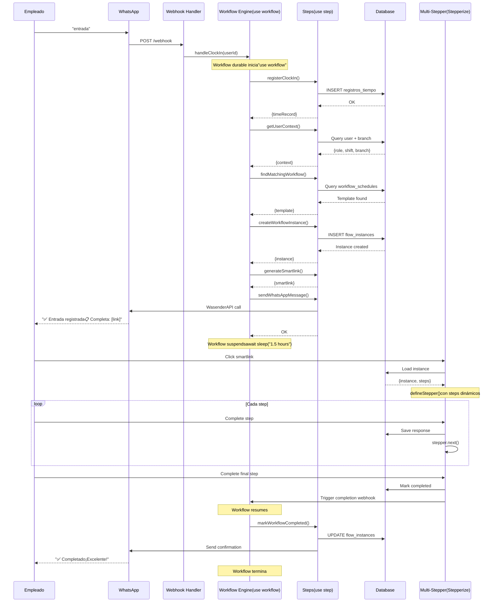

Creating comprehensive unified PRD for Pulso with Stepperize and Workflow DevKit integration
markdown

# Pulso - Product Requirements Document (PRD)
## Sistema de Supervisión Digital y Cumplimiento Operativo

**Version:** 3.0 (Unified)  
**Fecha:** 5 de Febrero, 2026  
**Autor:** Product Team  
**Estado:** En Desarrollo

---

## 📑 Tabla de Contenidos

1. [Resumen Ejecutivo](#resumen-ejecutivo)
2. [Visión y Estrategia del Producto](#visión-y-estrategia-del-producto)
3. [Análisis de Mercado](#análisis-de-mercado)
4. [Arquitectura del Sistema](#arquitectura-del-sistema)
5. [Stack Tecnológico](#stack-tecnológico)
6. [Especificaciones de Funcionalidades](#especificaciones-de-funcionalidades)
7. [Flujos de Usuario Principales](#flujos-de-usuario-principales)
8. [Roadmap de Implementación](#roadmap-de-implementación)
9. [Métricas de Éxito](#métricas-de-éxito)
10. [Gestión de Riesgos](#gestión-de-riesgos)

---

## 1. Resumen Ejecutivo

### 1.1 Visión del Producto

**Pulso** es una plataforma de supervisión digital y cumplimiento operativo diseñada específicamente para la industria HORECA (Hoteles, Restaurantes, Cafeterías) en México. La plataforma transforma WhatsApp en el centro de comando operativo, permitiendo a las empresas digitalizar sus operaciones, garantizar el cumplimiento normativo y optimizar la eficiencia operativa a través de workflows inteligentes y verificación automatizada con IA.

### 1.2 Propuesta de Valor Única

**Diferenciadores Clave:**

1. **WhatsApp como Entrada Universal**
   - Sin necesidad de descargar apps adicionales
   - Interfaz familiar para todos los empleados
   - Adopción instantánea (95% de mexicanos usan WhatsApp)

2. **Workflows Durables con Vercel Workflow DevKit**
   - Estado persistente automático
   - Recuperación automática de fallos
   - Ejecución asíncrona confiable
   - Sin necesidad de colas manuales

3. **Multi-Stepper Intuitivo con Stepperize**
   - Navegación fluida entre pasos
   - Type-safe por diseño
   - Auto-guardado progresivo
   - Mobile-first responsive

4. **Verificación Automática con IA**
   - 85% de fotos verificadas automáticamente
   - Reduce carga de supervisores en 80%
   - Detección inmediata de problemas
   - Optimización de costos (Moondream + OpenAI)

5. **Cumplimiento Normativo Integrado**
   - NOM-251 (Higiene alimentaria)
   - NOM-035 (Riesgos psicosociales)
   - Ley Federal del Trabajo
   - Reportes audit-ready en 1 click

### 1.3 Mercado Objetivo

**Segmento Primario:**
- Cadenas de restaurantes con 3-15 sucursales
- 5-50 empleados por sucursal
- Ingresos: $500K - $5M MXN mensuales
- Geografía inicial: Ciudad de México, Monterrey, Guadalajara

**Segmento Secundario:**
- Restaurantes independientes (1-2 sucursales)
- Cafeterías y panaderías
- Hoteles boutique con F&B

**Segmento Terciario:**
- Cadenas grandes (20+ sucursales)
- Hoteles con múltiples outlets
- Catering y servicios de alimentos

### 1.4 Modelo de Negocio

**Planes de Suscripción:**

| Plan | Precio MXN/mes | Precio USD/mes | Características |
|------|----------------|----------------|-----------------|
| **FREE** (Trial) | $0 | $0 | 1 sucursal, 5 usuarios, workflows básicos |
| **BÁSICO** | $3,999 | $199 | 5 sucursales, 50 usuarios, IA limitada |
| **PRO** (★) | $7,999 | $399 | 15 sucursales, 200 usuarios, IA ilimitada |
| **ENTERPRISE** | Custom | Custom | Ilimitado, SLA, white-label |

**Proyección de Ingresos (Año 1):**
```
Mes 1-3 (Beta):    10 clientes × $0     = $0 MRR
Mes 4-6:           25 clientes × $199   = $4,975 MRR
Mes 7-9:           50 clientes × $250   = $12,500 MRR
Mes 10-12:         100 clientes × $300  = $30,000 MRR

ARR Año 1: ~$200K USD
```

---

## 2. Visión y Estrategia del Producto

### 2.1 Filosofía del Producto

> **"Workflows Flexibles con Inteligencia de Cumplimiento"**

Pulso NO es:
- ❌ Una herramienta solo de cumplimiento (muy limitado)
- ❌ Un constructor genérico de workflows sin expertise
- ❌ Un sistema rígido que impone una forma de trabajar

Pulso ES:
- ✅ **Una plataforma de workflows** que permite construir CUALQUIER proceso operativo
- ✅ **Con expertise en cumplimiento** vía templates pre-construidos de NOM
- ✅ **Con reportería inteligente** que auto-genera documentación de auditoría

### 2.2 Estrategia de Producto

```
┌─────────────────────────────────────────────────────────┐
│        CAPA 1: WORKFLOW ENGINE (Core)                   │
├─────────────────────────────────────────────────────────┤
│ • Constructor de workflows drag-and-drop                │
│ • Ejecución vía web/mobile/WhatsApp                     │
│ • Verificación IA en pasos de foto                      │
│ • Almacenamiento de evidencia con timestamps            │
│ • Multi-tenant, multi-sucursal                          │
│                                                         │
│ Tecnologías:                                            │
│ • Vercel Workflow DevKit (workflows durables)           │
│ • Stepperize (multi-step forms)                         │
│ • WasenderAPI (WhatsApp Business)                       │
└─────────────────────────────────────────────────────────┘
                          ↓
┌─────────────────────────────────────────────────────────┐
│    CAPA 2: COMPLIANCE LAYER (Add-on Inteligente)       │
├─────────────────────────────────────────────────────────┤
│ ✅ Templates NOM-251 (10+ workflows pre-configurados)   │
│ ✅ Templates NOM-035 (evaluación riesgo psicosocial)    │
│ ✅ Templates Ley Laboral (breaks, horas extra)          │
│ ✅ Reportes de Cumplimiento (PDF/Excel para auditoría)  │
│                                                         │
│ Los usuarios pueden:                                    │
│ • Usar templates tal cual                               │
│ • Personalizar templates a sus necesidades             │
│ • Crear workflows 100% personalizados                   │
│ • Mezclar workflows de cumplimiento + operativos        │
└─────────────────────────────────────────────────────────┘
                          ↓
┌─────────────────────────────────────────────────────────┐
│      CAPA 3: INTELLIGENCE LAYER (Reportería)            │
├─────────────────────────────────────────────────────────┤
│ • Reportes operativos estándar (tasas de completitud)   │
│ • Reportes específicos de cumplimiento:                 │
│   ├─ Reporte de Auditoría NOM-251 (COFEPRIS-ready)     │
│   ├─ Reporte de Evaluación NOM-035 (STPS-ready)        │
│   ├─ Reporte de Cumplimiento Laboral                   │
│   └─ Log de Evidencia (todas las fotos/timestamps)      │
│                                                         │
│ • Auto-detección de workflows relacionados a compliance │
│ • Generación de reportes filtrando datos de compliance │
│ • Exportación con formatos y firmas oficiales          │
└─────────────────────────────────────────────────────────┘
```

**Principio de Diseño:**
> "Máxima flexibilidad, defaults inteligentes"

### 2.3 Ventaja Competitiva

| Característica | Pulso | Competencia Genérica | POS de Restaurante |
|---|---|---|---|
| Cumplimiento mexicano integrado | ✅ NOM-251, NOM-035, LFT | ❌ Configuración manual | ⚠️ Limitado |
| Verificación IA automática | ✅ Fotos + OCR | ❌ Ninguna | ❌ Ninguna |
| Ejecución vía WhatsApp | ✅ Soporte completo | ⚠️ Solo notificaciones | ❌ Ninguna |
| Reportes de auditoría | ✅ 1-click PDF/Excel | ❌ Export manual | ⚠️ Solo básicos |
| Workflows durables | ✅ Workflow DevKit | ❌ Lógica manual | ❌ N/A |
| Multi-stepper intuitivo | ✅ Stepperize | ❌ Formularios básicos | ❌ N/A |

---

## 3. Análisis de Mercado

### 3.1 Tamaño de Mercado

**México - Industria HORECA:**
- Total establecimientos: ~500,000
- Cadenas 3-15 sucursales: ~50,000
- Ticket promedio: $200-500 USD/mes

**TAM (Total Addressable Market):**
- 50,000 cadenas × $300/mes = $15M MRR = **$180M ARR**

**SAM (Serviceable Available Market):**
- 10% penetración en 3 años = 5,000 clientes
- 5,000 × $300/mes = **$18M ARR**

**SOM (Serviceable Obtainable Market - Año 1):**
- 200 clientes × $300/mes = **$720K ARR**

### 3.2 Competencia

**Competidores Directos:**
1. **Operadora de Cocinas** (México)
   - Enfoque: Consultoría + software básico
   - Precio: $500-1000 USD/mes
   - Debilidad: Interfaces complejas, poca tecnología

2. **SafeFood360** (Internacional)
   - Enfoque: Software de seguridad alimentaria
   - Precio: $400-800 USD/mes
   - Debilidad: No adaptado a México, sin WhatsApp

**Competidores Indirectos:**
1. **Monday.com / Asana**
   - Herramientas genéricas de gestión
   - Debilidad: No específicas para HORECA, sin cumplimiento

2. **POS Systems (Toast, Aloha)**
   - Incluyen algunas funciones básicas
   - Debilidad: Enfoque en ventas, no en operaciones/cumplimiento

**Ventaja de Pulso:**
- Único con WhatsApp nativo
- Único con IA de verificación
- Único con workflows durables (Workflow DevKit)
- Único con cumplimiento mexicano integrado
- Precio 50-70% menor que competencia

### 3.3 Usuarios y Personas

#### Persona 1: Dueño/Director
**María González, 38 años**
- Dueña de 5 restaurantes
- Problema: Falta de visibilidad en operaciones diarias
- Necesita: Dashboard ejecutivo, reportes de auditoría, control de costos
- Beneficios con Pulso:
  - Vista consolidada de todas las sucursales
  - Reportes de cumplimiento en 1 click
  - Reducción 30% en desperdicio de inventario
  - Evitar multas de COFEPRIS/STPS ($50K-500K MXN)

#### Persona 2: Gerente de Sucursal
**Carlos Ramírez, 32 años**
- Gerente de restaurante
- Problema: Supervisión manual consume 3+ horas diarias
- Necesita: Workflows claros, alertas automáticas, seguimiento de tareas
- Beneficios con Pulso:
  - 80% menos tiempo en supervisión manual
  - Alertas en tiempo real de problemas críticos
  - Reportes automáticos para corporativo

#### Persona 3: Empleado de Línea
**Ana López, 24 años**
- Personal de cocina
- Problema: Checklists en papel confusos, supervisor no siempre disponible
- Necesita: Instrucciones claras, confirmación inmediata
- Beneficios con Pulso:
  - Instrucciones paso a paso vía WhatsApp
  - Feedback instantáneo con IA
  - Registro automático de horas trabajadas

---

## 4. Arquitectura del Sistema

### 4.1 Diagrama de Arquitectura General

```
┌─────────────────────────────────────────────────────────┐
│                    PULSO SYSTEM                         │
├─────────────────────────────────────────────────────────┤
│                                                         │
│  ┌──────────────┐      ┌──────────────┐               │
│  │   WhatsApp   │──────│  WasenderAPI │               │
│  │   Business   │      │   Gateway    │               │
│  └──────────────┘      └──────┬───────┘               │
│                               │                         │
│  ┌────────────────────────────┼────────────────────┐   │
│  │        Pulso Backend       │                    │   │
│  │                           ▼                     │   │
│  │  ┌──────────────────────────────────────────┐  │   │
│  │  │   Workflow Orchestration Layer          │  │   │
│  │  │   (Vercel Workflow DevKit)              │  │   │
│  │  │                                          │  │   │
│  │  │  ┌────────────────────────────────────┐ │  │   │
│  │  │  │  Clock In/Out Handler              │ │  │   │
│  │  │  │  - Registro de entrada/salida       │ │  │   │
│  │  │  │  - Identificación de contexto       │ │  │   │
│  │  │  │  - "use workflow" (durable)         │ │  │   │
│  │  │  └────────────────────────────────────┘ │  │   │
│  │  │                                          │  │   │
│  │  │  ┌────────────────────────────────────┐ │  │   │
│  │  │  │  Workflow Trigger Engine            │ │  │   │
│  │  │  │  - Matching: rol/sucursal/turno     │ │  │   │
│  │  │  │  - Asignación automática            │ │  │   │
│  │  │  │  - Generación de smartlinks         │ │  │   │
│  │  │  └────────────────────────────────────┘ │  │   │
│  │  │                                          │  │   │
│  │  │  ┌────────────────────────────────────┐ │  │   │
│  │  │  │  Workflow Execution Engine          │ │  │   │
│  │  │  │  - Persistencia automática estado   │ │  │   │
│  │  │  │  - Recuperación de fallos           │ │  │   │
│  │  │  │  - Sleep/scheduling durables        │ │  │   │
│  │  │  └────────────────────────────────────┘ │  │   │
│  │  └──────────────────────────────────────────┘  │   │
│  │                 │                               │   │
│  │                 ▼                               │   │
│  │  ┌──────────────────────────────────────────┐  │   │
│  │  │      Business Logic Layer                │  │   │
│  │  │                                          │  │   │
│  │  │  ┌────────────────────────────────────┐ │  │   │
│  │  │  │  Steps Library (use step)          │ │  │   │
│  │  │  │  - fetchOrder()                    │ │  │   │
│  │  │  │  - chargePayment()                 │ │  │   │
│  │  │  │  - sendNotification()              │ │  │   │
│  │  │  │  - verifyPhoto()                   │ │  │   │
│  │  │  └────────────────────────────────────┘ │  │   │
│  │  │                                          │  │   │
│  │  │  ┌────────────────────────────────────┐ │  │   │
│  │  │  │  AI Verification Service            │ │  │   │
│  │  │  │  - Moondream (OCR básico)          │ │  │   │
│  │  │  │  - OpenAI (análisis complejo)      │ │  │   │
│  │  │  │  - Routing inteligente             │ │  │   │
│  │  │  └────────────────────────────────────┘ │  │   │
│  │  │                                          │  │   │
│  │  │  ┌────────────────────────────────────┐ │  │   │
│  │  │  │  Alert & Escalation System          │ │  │   │
│  │  │  │  - Detección de problemas           │ │  │   │
│  │  │  │  - Notificaciones multi-canal       │ │  │   │
│  │  │  │  - Escalación automática            │ │  │   │
│  │  │  └────────────────────────────────────┘ │  │   │
│  │  └──────────────────────────────────────────┘  │   │
│  │                 │                               │   │
│  │                 ▼                               │   │
│  │  ┌──────────────────────────────────────────┐  │   │
│  │  │      Database Layer                      │  │   │
│  │  │  (PostgreSQL + Drizzle ORM)              │  │   │
│  │  │                                          │  │   │
│  │  │  • Multi-tenant (Row Level Security)     │  │   │
│  │  │  • Workflow Templates                    │  │   │
│  │  │  • Workflow Instances + Event Log        │  │   │
│  │  │  • Time Records (Clock In/Out/Breaks)    │  │   │
│  │  │  • Evidence Storage (Photos, Data)       │  │   │
│  │  │  • Products & Inventory                  │  │   │
│  │  │  • Users, Companies, Branches            │  │   │
│  │  └──────────────────────────────────────────┘  │   │
│  └─────────────────────────────────────────────────┘   │
│                                                         │
│  ┌─────────────────────────────────────────────────┐   │
│  │        Multi-Stepper Webapp                     │   │
│  │        (Stepperize + React)                     │   │
│  │                                                 │   │
│  │  ┌───────────────────────────────────────────┐ │   │
│  │  │  Dynamic Workflow Renderer                │ │   │
│  │  │  - Carga workflow desde smartlink         │ │   │
│  │  │  - defineStepper() con steps dinámicos    │ │   │
│  │  │  - useStepper() para navegación           │ │   │
│  │  │  - Auto-save con debounce                 │ │   │
│  │  │  - Type-safe step transitions             │ │   │
│  │  └───────────────────────────────────────────┘ │   │
│  │                                                 │   │
│  │  ┌───────────────────────────────────────────┐ │   │
│  │  │  Step Components Library                  │ │   │
│  │  │  - PhotoStep (con IA verification)        │ │   │
│  │  │  - TextStep / NumberStep                  │ │   │
│  │  │  - MultipleChoiceStep                     │ │   │
│  │  │  - ChecklistStep                          │ │   │
│  │  │  - SignatureStep                          │ │   │
│  │  │  - TimerStep / TemperatureStep            │ │   │
│  │  └───────────────────────────────────────────┘ │   │
│  └─────────────────────────────────────────────────┘   │
│                                                         │
│  ┌─────────────────────────────────────────────────┐   │
│  │        Admin Dashboard                          │   │
│  │  - Workflow Builder (drag-and-drop)             │   │
│  │  - Real-time Monitoring                         │   │
│  │  - Compliance Reports Generator                 │   │
│  │  - User & Branch Management                     │   │
│  │  - Analytics & KPI Tracking                     │   │
│  └─────────────────────────────────────────────────┘   │
└─────────────────────────────────────────────────────────┘

┌─────────────────────────────────────────────────────────┐
│              External Services                          │
├─────────────────────────────────────────────────────────┤
│  - WasenderAPI (WhatsApp Business)                      │
│  - Moondream AI (Photo OCR)                             │
│  - OpenAI GPT-4 Vision (Complex Analysis)               │
│  - Cloudflare R2 (File Storage)                         │
│  - Upstash Redis (Caching & Session)                    │
│  - NeonDB (PostgreSQL Hosting)                          │
│  - Better Auth (Authentication)                         │
│  - Resend (Email Notifications)                         │
└─────────────────────────────────────────────────────────┘
```

### 4.2 Flujo de Datos

**Flujo Típico: Clock In → Workflow Execution**



---

## 5. Stack Tecnológico

### 5.1 Stack Completo

#### **Frontend**
```typescript
{
  "framework": "Next.js 15 (App Router)",
  "language": "TypeScript 5.3+",
  "ui": {
    "library": "React 18",
    "styling": "Tailwind CSS 4.0",
    "components": "shadcn/ui",
    "forms": {
      "core": "@stepperize/react",  // ← CLAVE: Multi-step workflows
      "validation": "react-hook-form + zod"
    }
  },
  "state": {
    "global": "Zustand",
    "server": "TanStack Query (React Query)",
    "forms": "react-hook-form"
  },
  "routing": "Next.js App Router",
  "auth": "Better Auth (Neon)"
}
```

#### **Backend**
```typescript
{
  "runtime": "Node.js 20+",
  "framework": "Next.js API Routes",
  "language": "TypeScript 5.3+",
  "workflows": "@vercel/workflow",  // ← CLAVE: Durable workflows
  "orm": {
    "library": "Drizzle ORM",
    "toolkit": "Drizzle Kit (migrations)"
  },
  "validation": "Zod",
  "caching": "Upstash Redis"
}
```

#### **Database**
```typescript
{
  "primary": "PostgreSQL 15+",
  "hosting": "NeonDB (Serverless Postgres)",
  "orm": "Drizzle ORM",
  "migrations": "Drizzle Kit",
  "features": [
    "Row-Level Security (RLS)",
    "JSON/JSONB columns",
    "Full-text search",
    "Connection pooling"
  ]
}
```

#### **Infrastructure**
```typescript
{
  "hosting": {
    "frontend": "Vercel",
    "backend": "Vercel (API Routes)",
    "workflows": "Vercel (Workflow Runtime)"
  },
  "storage": {
    "files": "Cloudflare R2",
    "cache": "Upstash Redis",
    "cdn": "Cloudflare CDN"
  },
  "monitoring": {
    "errors": "Sentry",
    "apm": "Vercel Analytics",
    "logs": "Vercel Logs"
  }
}
```

#### **External Services**
```typescript
{
  "whatsapp": "WasenderAPI (Multi-tenant WhatsApp Business)",
  "ai": {
    "ocr": "Moondream ($0.001/image)",
    "vision": "OpenAI GPT-4 Vision ($0.01/image)",
    "text": "OpenAI GPT-4"
  },
  "auth": "Better Auth (Neon)",
  "email": "Resend",
  "payments": "Stripe"
}
```

### 5.2 Justificación de Tecnologías Clave

#### **¿Por qué Vercel Workflow DevKit?**

**Problema que resuelve:**
Los workflows tradicionales requieren:
- Implementar manualmente colas (Redis/RabbitMQ)
- Gestionar reintentos y fallos
- Persistir estado entre pasos
- Manejar timeouts y scheduling

**Beneficios de Workflow DevKit:**
1. **Estado Persistente Automático**: Todo el estado se guarda automáticamente
2. **Recuperación de Fallos**: Si un paso falla, se reintenta automáticamente
3. **Suspensión/Resumption**: Workflows pueden dormir indefinidamente sin consumir recursos
4. **Simplicidad de Código**: Código imperativo normal (async/await)

**Ejemplo Comparativo:**

**Sin Workflow DevKit (manual):**
```typescript
// Necesitas configurar Redis, colas, reintentos, etc.
async function handleClockIn(userId: string) {
  // 1. Guardar estado manualmente
  await redis.set(`workflow:${userId}`, JSON.stringify({ step: 1 }));
  
  // 2. Añadir a cola para procesamiento
  await queue.add('clock-in', { userId });
  
  // 3. Worker separado para procesar
  queue.process('clock-in', async (job) => {
    // 4. Recuperar estado
    const state = await redis.get(`workflow:${job.data.userId}`);
    
    // 5. Lógica con manejo manual de errores
    try {
      // ... lógica ...
      
      // 6. Actualizar estado manualmente
      await redis.set(`workflow:${userId}`, JSON.stringify({ step: 2 }));
      
      // 7. Programar siguiente paso manualmente
      await queue.add('send-workflow', { userId }, { delay: 1000 });
    } catch (error) {
      // 8. Reintentos manuales
      if (job.attemptsMade < 3) {
        throw error; // Retry
      }
    }
  });
}
```

**Con Workflow DevKit:**
```typescript
export async function handleClockIn(userId: string) {
  "use workflow";  // ← Magia: esto lo convierte en workflow durable
  
  // 1. Registrar clock-in (auto-persisted)
  const timeRecord = await registerClockIn({ userId });
  
  // 2. Encontrar workflow matching (auto-retry si falla)
  const template = await findMatchingWorkflow(userId);
  
  // 3. Crear instancia (auto-persisted)
  const instance = await createWorkflowInstance(template, userId);
  
  // 4. Generar smartlink
  const link = await generateSmartlink(instance.id);
  
  // 5. Enviar WhatsApp (auto-retry si falla)
  await sendWhatsAppMessage(userId, { message: `Completa: ${link}` });
  
  // 6. Dormir 1.5 horas SIN consumir recursos (suspende workflow)
  await sleep("1.5 hours");
  
  // 7. Verificar si completó (workflow se reanuda automáticamente)
  const status = await getWorkflowStatus(instance.id);
  
  if (status === "PENDING") {
    // 8. Enviar recordatorio
    await sendWhatsAppMessage(userId, { message: "Recordatorio..." });
  }
  
  // Todo esto persiste, se recupera de fallos, y maneja reintentos automáticamente
}
```

**Resultado:**
- 90% menos código
- Cero configuración de infraestructura (colas, workers)
- Reintentos automáticos
- Estado persistente sin esfuerzo
- Sleep eficiente (sin consumir recursos)

#### **¿Por qué Stepperize?**

**Problema que resuelve:**
Multi-step forms son complicados:
- Gestión de estado entre pasos
- Navegación (next, prev, jump)
- Validación por paso
- Progreso visual
- Type safety

**Beneficios de Stepperize:**
1. **Type-Safe**: Inferencia automática de tipos
2. **Flexible**: Soporte para flujos lineales y condicionales
3. **Auto-save**: Progreso persistente automáticamente
4. **Mobile-First**: Responsive por diseño
5. **Integración Simple**: Hooks + componentes primitivos

**Ejemplo de Uso:**

```typescript
// 1. Definir stepper con pasos dinámicos del workflow
const { Stepper, useStepper } = defineStepper(
  { id: 'temp', label: 'Temperatura' },
  { id: 'photo', label: 'Foto' },
  { id: 'checklist', label: 'Verificación' },
  { id: 'signature', label: 'Firma' }
);

function WorkflowExecutor() {
  const stepper = useStepper();
  
  // 2. Auto-save en cada cambio
  useAutoSave({
    workflowId: workflow.id,
    currentStep: stepper.current.index,
    data: stepper.state
  });
  
  return (
    
      {/* 3. Navegación automática */}
      
        
      
      
      
        
      
      
      
        
      
      
      
        <SignatureStep onComplete={() => completeWorkflow()} />
      
    
  );
}
```

**Resultado:**
- Código limpio y declarativo
- Type-safety completo
- Auto-save sin configuración extra
- Navegación intuitiva

---

## 6. Especificaciones de Funcionalidades

### 6.1 CORE: Workflow Engine

#### 6.1.1 Workflow Template Builder

**Prioridad:** P0 (Crítico - MVP)  
**User Story:** Como gerente, quiero crear workflows personalizados para cualquier proceso operativo

**Capacidades Core:**
- Constructor visual drag-and-drop
- Tipos de pasos soportados:
  - `text_input`: Entrada de texto libre
  - `number_input`: Entrada numérica (ej: temperatura)
  - `yes_no`: Decisión binaria
  - `multiple_choice`: Selección de opciones
  - `photo`: Captura de imagen con verificación IA
  - `signature`: Firma digital
  - `checklist`: Lista de verificación múltiple
  - `timer`: Tarea basada en tiempo

**Configuración por Paso:**
```typescript
interface WorkflowStep {
  id: string;
  order: number;
  type: StepType;
  title: string;
  description?: string;
  instructions?: string;
  required: boolean;
  
  // Validación
  validation?: {
    min?: number;
    max?: number;
    regex?: string;
    customRule?: string;
  };
  
  // IA Verification (solo para photo steps)
  aiVerification?: {
    enabled: boolean;
    type: 'OCR' | 'CLASIFICACION' | 'DETECCION_OBJETOS' | 'ANALISIS_CALIDAD';
    minConfidence: number;
    expectedObjects?: string[];
    autoApprove: boolean;
  };
  
  // Lógica condicional
  conditionalLogic?: {
    showIf?: {
      stepId: string;
      condition: 'equals' | 'not_equals' | 'greater_than' | 'less_than';
      value: any;
    };
  };
}
```

**Requerimientos Técnicos:**
- Schema JSON para definición de workflows
- Almacenamiento en tabla `flow_templates`
- Validación con Zod schemas
- Soporte para 100+ pasos por workflow (típicamente 5-15)
- Versionado de templates (v1, v2, etc.)

**UI/UX:**
```
┌─────────────────────────────────────────────────────────┐
│ Workflow Builder                            [Save] [Preview] │
├─────────────┬───────────────────────────┬──────────────┤
│             │                           │              │
│  STEP       │     WORKFLOW CANVAS       │  PROPERTIES  │
│  LIBRARY    │                           │              │
│             │  1. ┌───────────────┐    │  Step 3:     │
│ 📝 Text     │     │ Temperatura   │    │  Photo       │
│ 🔢 Number   │     │ Refrigerador  │    │              │
│ 📷 Photo    │     └───────────────┘    │  Title:      │
│ ✓  Checklist│                          │  [________]  │
│ ✍️  Signature│  2. ┌───────────────┐   │              │
│ ⏱️  Timer    │     │ Verificación  │    │  Required:   │
│             │     │ Visual        │    │  [x] Yes     │
│             │     └───────────────┘    │              │
│             │                          │  AI Verify:  │
│             │  3. ┌───────────────┐    │  [x] Enable  │
│             │     │ Foto de Área │ ← │              │
│             │     └───────────────┘    │  Type:       │
│             │                          │  [Cleanliness]│
│             │  4. ┌───────────────┐    │              │
│             │     │ Firma        │    │  Min Conf:   │
│             │     └───────────────┘    │  [85%]       │
│             │                          │              │
└─────────────┴───────────────────────────┴──────────────┘
```

**API Endpoints:**
```typescript
// Templates
POST   /api/flow-templates         // Crear template
GET    /api/flow-templates         // Listar templates
GET    /api/flow-templates/:id     // Obtener template
PATCH  /api/flow-templates/:id     // Actualizar template
DELETE /api/flow-templates/:id     // Archivar template
POST   /api/flow-templates/:id/duplicate  // Duplicar template
```

---

#### 6.1.2 Workflow Execution Engine (con Workflow DevKit)

**Prioridad:** P0 (Crítico - MVP)  
**User Story:** Como empleado, quiero completar workflows asignados paso a paso

**Arquitectura con Workflow DevKit:**

```typescript
// workflows/execute-workflow.workflow.ts
import { sleep, createWebhook } from "@vercel/workflow";

export async function executeWorkflow(instanceId: string, userId: string) {
  "use workflow";  // ← Workflow durable
  
  // Step 1: Cargar instancia
  const instance = await loadWorkflowInstance(instanceId);
  
  // Step 2: Marcar como iniciado
  await markWorkflowStarted(instanceId);
  
  // Step 3: Generar smartlink
  const smartlink = await generateSmartlink(instanceId, userId);
  
  // Step 4: Enviar notificación inicial
  await sendWhatsAppNotification(userId, {
    message: `Completa tu checklist: ${smartlink}`,
  });
  
  // Step 5: Crear webhook para esperar completitud
  const completionWebhook = createWebhook();
  
  // Step 6: Esperar completitud O timeout (2 horas)
  const result = await Promise.race([
    completionWebhook,  // Se resuelve cuando usuario completa
    sleep("2 hours").then(() => ({ status: "timeout" }))
  ]);
  
  if (result.status === "timeout") {
    // Workflow expiró
    await markWorkflowExpired(instanceId);
    await createAlert({
      type: "WORKFLOW_EXPIRED",
      severity: "WARNING",
      instanceId,
      userId,
    });
    return { success: false, reason: "timeout" };
  }
  
  // Workflow completado exitosamente
  await markWorkflowCompleted(instanceId);
  await sendWhatsAppNotification(userId, {
    message: "✅ Checklist completado. ¡Excelente trabajo!"
  });
  
  return { success: true, completedAt: new Date() };
}

// Steps (full Node.js access)
async function loadWorkflowInstance(instanceId: string) {
  "use step";
  
  const instance = await db.query.flowInstances.findFirst({
    where: eq(flowInstances.id, instanceId),
    with: { template: true },
  });
  
  if (!instance) {
    throw new Error("Workflow instance not found");
  }
  
  return instance;
}

async function markWorkflowStarted(instanceId: string) {
  "use step";
  
  await db.update(flowInstances)
    .set({
      status: "IN_PROGRESS",
      startedAt: new Date(),
    })
    .where(eq(flowInstances.id, instanceId));
}

async function generateSmartlink(instanceId: string, userId: string) {
  "use step";
  
  const token = jwt.sign(
    { instanceId, userId, type: "workflow" },
    process.env.JWT_SECRET!,
    { expiresIn: "4h" }
  );
  
  return `${process.env.NEXT_PUBLIC_APP_URL}/w/${token}`;
}

async function sendWhatsAppNotification(userId: string, payload: any) {
  "use step";
  
  const user = await db.query.usuarios.findFirst({
    where: eq(usuarios.id, userId),
  });
  
  if (!user?.whatsappPhone) {
    throw new Error("User has no WhatsApp phone");
  }
  
  // WasenderAPI call
  const response = await fetch(`${WASENDER_API_URL}/messages/send`, {
    method: "POST",
    headers: {
      "Authorization": `Bearer ${WASENDER_API_KEY}`,
      "Content-Type": "application/json",
    },
    body: JSON.stringify({
      phone: user.whatsappPhone,
      message: payload.message,
    }),
  });
  
  if (!response.ok) {
    throw new Error("Failed to send WhatsApp message");
  }
  
  return response.json();
}
```

**Flujo de Ejecución:**
```
1. Usuario abre workflow instance (via smartlink)
2. Sistema carga template + pasos
3. Renderiza paso 1 de N con Stepperize
4. Usuario completa input/evidencia requerida
5. Sistema valida input (client + server)
6. Si es foto + IA habilitado:
   - Subir foto a R2
   - Llamar API de verificación IA
   - Mostrar resultado de verificación
   - Si falla, permitir reintento
7. Guardar respuesta del paso en DB
8. Avanzar a paso 2 de N
9. Repetir hasta todos los pasos completados
10. Usuario confirma completitud
11. Sistema marca workflow como COMPLETED
12. Trigger webhook en workflow durable para continuar
```

**Features Clave:**
- **Auto-save**: Progreso se guarda cada 30 segundos
- **Resume**: Workflows interrumpidos se pueden retomar
- **Offline Support** (PWA): Queue de sincronización
- **Progress Indicator**: Preciso a nivel de paso
- **Optimistic UI**: Updates con rollback en fallo

---

#### 6.1.3 Multi-Stepper Webapp (con Stepperize)

**Prioridad:** P0 (Crítico - MVP)  
**User Story:** Como empleado, quiero una interfaz intuitiva para completar workflows paso a paso

**Implementación con Stepperize:**

```typescript
// app/w/[token]/page.tsx
"use client";

import { defineStepper } from "@stepperize/react";
import { useWorkflowInstance } from "@/hooks/use-workflow";
import { PhotoStep, TextStep, NumberStep, ChecklistStep, SignatureStep } from "@/components/steps";
import { Loader2 } from "lucide-react";

export default function WorkflowPage({ params }: { params: { token: string } }) {
  // 1. Cargar workflow instance desde token
  const { workflow, isLoading, error } = useWorkflowInstance(params.token);
  
  if (isLoading) {
    return (
      
        
      
    );
  }
  
  if (error || !workflow) {
    return (
      
        Error
        {error?.message || "Workflow no encontrado"}
      
    );
  }
  
  // 2. Definir stepper dinámicamente con los pasos del workflow
  const { Stepper, useStepper } = defineStepper(
    ...workflow.steps.map(step => ({
      id: step.id,
      label: step.title,
      description: step.description,
    }))
  );
  
  return (
    
      
        
        
        
      
    
  );
}

// Componente principal de ejecución
function WorkflowContent({ workflow }: { workflow: WorkflowInstance }) {
  const stepper = useStepper();
  const currentStep = workflow.steps[stepper.current.index];
  
  // Auto-save progress cada 30 segundos
  useAutoSave({
    workflowId: workflow.id,
    currentStepIndex: stepper.current.index,
    responses: stepper.state,
    debounceMs: 30000,
  });
  
  const handleStepComplete = async (stepId: string, response: any) => {
    // 1. Guardar respuesta del paso
    await saveStepResponse({
      instanceId: workflow.id,
      stepId,
      response,
    });
    
    // 2. Validar si es necesario
    if (currentStep.validation) {
      const validationResult = await validateStepResponse({
        stepId,
        response,
        rules: currentStep.validation,
      });
      
      if (!validationResult.isValid) {
        toast.error(validationResult.message);
        return;
      }
    }
    
    // 3. Verificación IA para fotos
    if (currentStep.type === "PHOTO" && currentStep.aiVerification?.enabled) {
      const aiResult = await verifyPhotoWithAI({
        photoUrl: response.photoUrl,
        verificationType: currentStep.aiVerification.type,
        minConfidence: currentStep.aiVerification.minConfidence,
      });
      
      if (aiResult.confidence < currentStep.aiVerification.minConfidence) {
        // Crear alerta para supervisor
        await createAlert({
          type: "AI_VERIFICATION_FAILED",
          severity: "WARNING",
          workflowId: workflow.id,
          stepId,
          message: `Foto requiere revisión manual (confianza: ${aiResult.confidence})`,
        });
        
        toast.warning("Foto registrada. Un supervisor la revisará.");
      } else {
        toast.success("✓ Foto verificada automáticamente");
      }
    }
    
    // 4. Avanzar al siguiente paso
    if (!stepper.isLast) {
      stepper.next();
    } else {
      // Workflow completado - trigger webhook
      await completeWorkflow(workflow.id);
      router.push(`/w/${workflow.id}/completed`);
    }
  };
  
  return (
    
      {/* Progress bar */}
      
        
          Paso {stepper.current.index + 1} de {stepper.all.length}
          {Math.round((stepper.current.index / stepper.all.length) * 100)}%
        
        
          <div
            className="h-full bg-blue-600 transition-all duration-300"
            style={{ width: `${(stepper.current.index / stepper.all.length) * 100}%` }}
          />
        
      
      
      {/* Step content switcher */}
      {stepper.all.map((step, index) => (
        
          
        
      ))}
    
  );
}

// Renderizador dinámico de tipos de pasos
function StepRenderer({ step, onComplete }: StepRendererProps) {
  switch (step.type) {
    case "PHOTO":
      return ;
    case "TEXT":
      return ;
    case "NUMBER":
      return ;
    case "YES_NO":
      return ;
    case "MULTIPLE_CHOICE":
      return ;
    case "CHECKLIST":
      return ;
    case "SIGNATURE":
      return ;
    case "TIMER":
      return ;
    default:
      return Tipo de paso no soportado: {step.type};
  }
}

// Hook para auto-save
function useAutoSave({ workflowId, currentStepIndex, responses, debounceMs = 30000 }) {
  const debouncedSave = useDebouncedCallback(
    async () => {
      await fetch(`/api/workflows/${workflowId}/progress`, {
        method: "PATCH",
        headers: { "Content-Type": "application/json" },
        body: JSON.stringify({
          currentStep: currentStepIndex,
          responses,
        }),
      });
    },
    debounceMs
  );
  
  useEffect(() => {
    debouncedSave();
  }, [currentStepIndex, responses, debouncedSave]);
}
```

**Características Clave:**

1. **Type-Safe Navigation**: Stepperize infiere tipos automáticamente
2. **Auto-Save**: Progreso guardado cada 30 segundos
3. **Progress Indicator**: Barra de progreso visual
4. **Conditional Steps**: Lógica condicional soportada
5. **Resume Capability**: Workflows pueden pausarse y retomarse
6. **Mobile-First**: Responsive por diseño

---

### 6.2 INTELIGENCIA: Verificación con IA

#### 6.2.1 AI Provider Integration

**Prioridad:** P1 (Alto - MVP)  
**User Story:** Como sistema, necesito verificar evidencia fotográfica automáticamente

**Estrategia Multi-Provider:**

```typescript
// services/ai-verification/router.ts
export async function verifyPhoto(params: {
  photoUrl: string;
  verificationType: AIVerificationType;
  minConfidence?: number;
}): Promise {
  const { photoUrl, verificationType, minConfidence = 0.85 } = params;
  
  // Routing logic basado en tipo de verificación
  const provider = selectProvider(verificationType);
  
  try {
    let result: AIVerificationResult;
    
    switch (provider) {
      case "moondream":
        result = await verifyWithMoondream(photoUrl, verificationType);
        break;
      case "openai":
        result = await verifyWithOpenAI(photoUrl, verificationType);
        break;
      case "anthropic":
        result = await verifyWithAnthropic(photoUrl, verificationType);
        break;
      default:
        throw new Error(`Unknown provider: ${provider}`);
    }
    
    // Fallback si confianza es baja y no es Moondream
    if (result.confidence < minConfidence && provider === "moondream") {
      console.log("Moondream confidence low, falling back to OpenAI");
      result = await verifyWithOpenAI(photoUrl, verificationType);
    }
    
    // Track cost
    await trackAICost({
      provider,
      verificationType,
      cost: getProviderCost(provider),
      confidence: result.confidence,
    });
    
    return result;
    
  } catch (error) {
    console.error(`AI verification failed with ${provider}:`, error);
    
    // Fallback to OpenAI if Moondream fails
    if (provider === "moondream") {
      return verifyWithOpenAI(photoUrl, verificationType);
    }
    
    throw error;
  }
}

function selectProvider(verificationType: AIVerificationType): AIProvider {
  // Simple OCR/clasificación → Moondream (barato)
  if (["OCR", "CLASIFICACION_SIMPLE"].includes(verificationType)) {
    return "moondream";
  }
  
  // Análisis complejo → OpenAI
  if (["ANALISIS_CALIDAD", "DETECCION_OBJETOS"].includes(verificationType)) {
    return "openai";
  }
  
  // Análisis de documentos → Anthropic
  if (["ANALISIS_DOCUMENTOS"].includes(verificationType)) {
    return "anthropic";
  }
  
  // Default: Moondream
  return "moondream";
}

function getProviderCost(provider: AIProvider): number {
  const costs = {
    moondream: 0.001,   // $0.001 per image
    openai: 0.01,       // $0.01 per image
    anthropic: 0.015,   // $0.015 per image
  };
  return costs[provider];
}
```

**Implementación por Provider:**

```typescript
// services/ai-verification/providers/moondream.ts
import Moondream from "moondream";

const moondream = new Moondream({
  apiKey: process.env.MOONDREAM_API_KEY!,
});

export async function verifyWithMoondream(
  photoUrl: string,
  verificationType: AIVerificationType
): Promise {
  const prompts: Record = {
    OCR: "Extract all visible text from this image. Return only the text.",
    CLASIFICACION_SIMPLE: "Classify this image. Is it clean and ready for food preparation? Answer with yes or no and a confidence score.",
    ANALISIS_TEMPERATURA: "What temperature is displayed on this thermometer? Provide only the number.",
  };
  
  const prompt = prompts[verificationType];
  
  if (!prompt) {
    throw new Error(`No prompt defined for verification type: ${verificationType}`);
  }
  
  const result = await moondream.analyze({
    imageUrl: photoUrl,
    prompt,
  });
  
  // Parse response
  const confidence = extractConfidence(result.text);
  const verified = confidence >= 0.85;
  
  return {
    provider: "moondream",
    verified,
    confidence,
    findings: [result.text],
    cost: 0.001,
  };
}

// services/ai-verification/providers/openai.ts
import OpenAI from "openai";

const openai = new OpenAI({
  apiKey: process.env.OPENAI_API_KEY!,
});

export async function verifyWithOpenAI(
  photoUrl: string,
  verificationType: AIVerificationType
): Promise {
  const systemPrompts: Record = {
    ANALISIS_CALIDAD: `You are a quality control inspector for a restaurant kitchen. 
Analyze this image and determine if it meets food safety standards. 
Look for cleanliness, proper storage, equipment condition, and any potential hazards.
Provide a detailed assessment and a confidence score (0-100).`,
    
    DETECCION_OBJETOS: `You are a safety compliance checker.
Identify all required safety equipment in this image.
List what you see and what might be missing.
Provide a confidence score for your assessment.`,
  };
  
  const systemPrompt = systemPrompts[verificationType];
  
  const response = await openai.chat.completions.create({
    model: "gpt-4-vision-preview",
    messages: [
      {
        role: "system",
        content: systemPrompt,
      },
      {
        role: "user",
        content: [
          { type: "text", text: "Analyze this image according to the instructions." },
          { type: "image_url", image_url: { url: photoUrl } },
        ],
      },
    ],
    max_tokens: 500,
  });
  
  const analysis = response.choices[0].message.content || "";
  const confidence = extractConfidenceFromGPT(analysis);
  
  return {
    provider: "openai",
    verified: confidence >= 0.85,
    confidence,
    findings: [analysis],
    cost: 0.01,
  };
}
```

**Cost Tracking:**

```typescript
// services/ai-verification/cost-tracking.ts
export async function trackAICost(params: {
  provider: AIProvider;
  verificationType: AIVerificationType;
  cost: number;
  confidence: number;
}) {
  await db.insert(aiVerificationLogs).values({
    provider: params.provider,
    verificationType: params.verificationType,
    cost: params.cost,
    confidence: params.confidence,
    timestamp: new Date(),
  });
  
  // Update monthly cost counter
  const currentMonth = new Date().toISOString().slice(0, 7); // "2026-02"
  
  await db
    .insert(aiMonthlyCosts)
    .values({
      month: currentMonth,
      provider: params.provider,
      totalCost: params.cost,
      totalVerifications: 1,
    })
    .onConflictDoUpdate({
      target: [aiMonthlyCosts.month, aiMonthlyCosts.provider],
      set: {
        totalCost: sql`${aiMonthlyCosts.totalCost} + ${params.cost}`,
        totalVerifications: sql`${aiMonthlyCosts.totalVerifications} + 1`,
      },
    });
}
```

**Optimización de Costos:**

Objetivo: 70% Moondream, 30% OpenAI
- Moondream: $0.001/imagen → OCR básico, clasificación simple
- OpenAI: $0.01/imagen → Análisis complejo, calidad

**Costo Promedio Esperado:**
- 70% × $0.001 + 30% × $0.01 = $0.0037 por verificación
- 1000 verificaciones/mes = $3.70/mes
- 10,000 verificaciones/mes = $37/mes

---

### 6.3 WHATSAPP: Integración y Workflows

#### 6.3.1 WhatsApp Setup Multi-Tenant (WasenderAPI)

**Prioridad:** P0 (Crítico - MVP)  
**User Story:** Como empresa, quiero conectar mi número de WhatsApp a Pulso

**Implementación con WasenderAPI:**

```typescript
// services/whatsapp/wasender-client.ts
export class WasenderClient {
  private apiUrl: string;
  private apiKey: string;
  
  constructor() {
    this.apiUrl = process.env.WASENDER_API_URL!;
    this.apiKey = process.env.WASENDER_API_KEY!;
  }
  
  // Crear sesión aislada para una empresa
  async createSession(empresaId: string): Promise {
    const response = await fetch(`${this.apiUrl}/session/create`, {
      method: "POST",
      headers: {
        "Authorization": `Bearer ${this.apiKey}`,
        "Content-Type": "application/json",
      },
      body: JSON.stringify({
        sessionId: `empresa_${empresaId}`,
        webhook: `${process.env.NEXT_PUBLIC_APP_URL}/api/whatsapp/webhook`,
      }),
    });
    
    if (!response.ok) {
      throw new Error("Failed to create WhatsApp session");
    }
    
    const data = await response.json();
    
    // Guardar sesión en DB
    await db.insert(whatsappSessions).values({
      empresaId,
      sessionId: data.sessionId,
      status: "DISCONNECTED",
      qrCode: data.qrCode,
      createdAt: new Date(),
    });
    
    return data;
  }
  
  // Obtener código QR para conexión
  async getQRCode(sessionId: string): Promise {
    const response = await fetch(`${this.apiUrl}/session/qr/${sessionId}`, {
      headers: {
        "Authorization": `Bearer ${this.apiKey}`,
      },
    });
    
    if (!response.ok) {
      throw new Error("Failed to get QR code");
    }
    
    const data = await response.json();
    return data.qrCode;
  }
  
  // Verificar estado de sesión
  async getSessionStatus(sessionId: string): Promise {
    const response = await fetch(`${this.apiUrl}/session/status/${sessionId}`, {
      headers: {
        "Authorization": `Bearer ${this.apiKey}`,
      },
    });
    
    if (!response.ok) {
      throw new Error("Failed to get session status");
    }
    
    const data = await response.json();
    
    // Actualizar estado en DB
    await db
      .update(whatsappSessions)
      .set({
        status: data.state as WhatsAppSessionStatus,
        updatedAt: new Date(),
      })
      .where(eq(whatsappSessions.sessionId, sessionId));
    
    return data;
  }
  
  // Enviar mensaje
  async sendMessage(params: {
    sessionId: string;
    phone: string;
    message: string;
  }): Promise {
    const response = await fetch(`${this.apiUrl}/messages/send`, {
      method: "POST",
      headers: {
        "Authorization": `Bearer ${this.apiKey}`,
        "Content-Type": "application/json",
      },
      body: JSON.stringify({
        sessionId: params.sessionId,
        phone: params.phone,
        message: params.message,
      }),
    });
    
    if (!response.ok) {
      const error = await response.text();
      throw new Error(`Failed to send message: ${error}`);
    }
    
    // Log mensaje enviado
    await db.insert(whatsappMessages).values({
      sessionId: params.sessionId,
      phone: params.phone,
      message: params.message,
      direction: "OUTBOUND",
      status: "SENT",
      sentAt: new Date(),
    });
  }
  
  // Desconectar sesión
  async disconnectSession(sessionId: string): Promise {
    await fetch(`${this.apiUrl}/session/${sessionId}`, {
      method: "DELETE",
      headers: {
        "Authorization": `Bearer ${this.apiKey}`,
      },
    });
    
    await db
      .update(whatsappSessions)
      .set({
        status: "DISCONNECTED",
        updatedAt: new Date(),
      })
      .where(eq(whatsappSessions.sessionId, sessionId));
  }
}
```

**Flujo de Setup:**

```
1. Admin va a Settings > WhatsApp Integration
2. Click "Conectar WhatsApp"
3. Sistema crea sesión aislada vía WasenderAPI
4. Sistema muestra código QR
5. Admin escanea QR con WhatsApp
6. Sesión conectada, status → "ACTIVE"
7. Sistema registra webhook para mensajes entrantes
```

**API Endpoints:**

```typescript
// app/api/whatsapp/setup/route.ts
export async function POST(request: Request) {
  const { empresaId } = await request.json();
  
  const wasender = new WasenderClient();
  const session = await wasender.createSession(empresaId);
  
  return Response.json({
    sessionId: session.sessionId,
    qrCode: session.qrCode,
    status: "DISCONNECTED",
  });
}

// app/api/whatsapp/status/[sessionId]/route.ts
export async function GET(
  request: Request,
  { params }: { params: { sessionId: string } }
) {
  const wasender = new WasenderClient();
  const status = await wasender.getSessionStatus(params.sessionId);
  
  return Response.json(status);
}
```

---

#### 6.3.2 Webhook Handler & Message Processing

**Prioridad:** P0 (Crítico - MVP)  
**User Story:** Como sistema, necesito procesar mensajes entrantes de WhatsApp

```typescript
// app/api/whatsapp/webhook/route.ts
import { handleClockIn } from "@/workflows/clock-in.workflow";
import { handleClockOut } from "@/workflows/clock-out.workflow";
import { handleBreak } from "@/workflows/break.workflow";

export async function POST(request: Request) {
  const body = await request.json();
  
  // WasenderAPI webhook format
  const { sessionId, phone, message, timestamp, type } = body;
  
  // Log mensaje recibido
  await db.insert(whatsappMessages).values({
    sessionId,
    phone,
    message,
    direction: "INBOUND",
    status: "RECEIVED",
    receivedAt: new Date(timestamp),
  });
  
  // Encontrar usuario por teléfono
  const user = await db.query.usuarios.findFirst({
    where: or(
      eq(usuarios.whatsappPhone, phone),
      eq(usuarios.telefono, phone)
    ),
    with: { empresa: true, sucursal: true },
  });
  
  if (!user) {
    // Usuario no encontrado
    await sendWhatsAppMessage(sessionId, phone, {
      message: "❌ No encontramos tu cuenta. Contacta a tu supervisor.",
    });
    return Response.json({ success: false, error: "User not found" });
  }
  
  // Parsear comando
  const command = message.trim().toLowerCase();
  
  try {
    if (["entrada", "clock in", "checkin", "entrar"].includes(command)) {
      // Trigger clock in workflow (durable)
      await handleClockIn(user.id, user.sucursalId!);
      
    } else if (["salida", "clock out", "checkout", "salir"].includes(command)) {
      // Trigger clock out workflow (durable)
      await handleClockOut(user.id, user.sucursalId!);
      
    } else if (["pausa", "break", "descanso"].includes(command)) {
      // Iniciar break
      await handleBreak(user.id, user.sucursalId!, "START");
      
    } else if (["fin pausa", "end break", "terminar pausa", "volver"].includes(command)) {
      // Terminar break
      await handleBreak(user.id, user.sucursalId!, "END");
      
    } else if (["horas", "status", "resumen"].includes(command)) {
      // Resumen del día
      const summary = await getDailySummary(user.id);
      await sendWhatsAppMessage(sessionId, phone, { message: summary });
      
    } else if (["tareas", "pendientes", "workflows"].includes(command)) {
      // Listar workflows pendientes
      const pending = await getPendingWorkflows(user.id);
      await sendWhatsAppMessage(sessionId, phone, { message: pending });
      
    } else if (["ayuda", "help", "comandos"].includes(command)) {
      // Ayuda
      await sendWhatsAppMessage(sessionId, phone, {
        message: `Comandos disponibles:

📥 entrada - Registrar entrada
📤 salida - Registrar salida
☕ pausa - Iniciar descanso
⏰ fin pausa - Terminar descanso
📊 horas - Ver resumen del día
📋 tareas - Ver tareas pendientes
❓ ayuda - Ver comandos`,
      });
      
    } else {
      // Comando no reconocido
      await sendWhatsAppMessage(sessionId, phone, {
        message: `No entendí "${message}". Escribe "ayuda" para ver comandos disponibles.`,
      });
    }
    
    return Response.json({ success: true });
    
  } catch (error) {
    console.error("Error processing WhatsApp message:", error);
    
    await sendWhatsAppMessage(sessionId, phone, {
      message: "❌ Ocurrió un error. Por favor intenta de nuevo o contacta a soporte.",
    });
    
    return Response.json({ success: false, error: error.message }, { status: 500 });
  }
}

// Helper function
async function sendWhatsAppMessage(
  sessionId: string,
  phone: string,
  payload: { message: string }
) {
  const wasender = new WasenderClient();
  await wasender.sendMessage({ sessionId, phone, message: payload.message });
}
```

**Natural Language Processing (Simple):**

```typescript
// utils/nlp/command-parser.ts
export function parseCommand(message: string): Command | null {
  const text = message.trim().toLowerCase();
  
  // Clock in patterns
  if (/^(entrada|clock\s*in|checkin|entrar|inicio)$/i.test(text)) {
    return { type: "CLOCK_IN" };
  }
  
  // Clock out patterns
  if (/^(salida|clock\s*out|checkout|salir|termino)$/i.test(text)) {
    return { type: "CLOCK_OUT" };
  }
  
  // Break start patterns
  if (/^(pausa|break|descanso|comida)$/i.test(text)) {
    return { type: "BREAK_START" };
  }
  
  // Break end patterns
  if (/^(fin\s*pausa|end\s*break|terminar\s*pausa|volver)$/i.test(text)) {
    return { type: "BREAK_END" };
  }
  
  // Status patterns
  if (/^(horas|status|resumen|tiempo)$/i.test(text)) {
    return { type: "STATUS" };
  }
  
  // Tasks patterns
  if (/^(tareas|pendientes|workflows|checklists)$/i.test(text)) {
    return { type: "TASKS" };
  }
  
  // Help patterns
  if (/^(ayuda|help|comandos|\?)$/i.test(text)) {
    return { type: "HELP" };
  }
  
  // Number selection (para seleccionar workflow)
  const numberMatch = text.match(/^(\d+)$/);
  if (numberMatch) {
    return { type: "SELECT_NUMBER", value: parseInt(numberMatch[1]) };
  }
  
  return null;
}
```

---

## 7. Flujos de Usuario Principales

### 7.1 Flujo: Clock In → Workflow Assignment → Execution → Completion

**Diagrama de Secuencia:**



**Paso a Paso Detallado:**

**1. Clock In (08:02 AM)**
```
Empleado → WhatsApp: "entrada"
Sistema → registra timestamp, geolocalización, método (WhatsApp)
```

**2. Identificación de Contexto**
```
Sistema identifica:
- Usuario: Juan Pérez (ID: usr_123)
- Sucursal: Centro (ID: branch_001)
- Rol: EMPLEADO
- Turno: MATUTINO (detectado por hora actual)
- Día: Lunes
```

**3. Workflow Matching**
```sql
SELECT * FROM workflow_schedules
WHERE sucursal_id = 'branch_001'
  AND 'EMPLEADO' = ANY(assigned_roles)
  AND 1 = ANY(dias_semana)  -- Lunes
  AND hora_inicio <= '08:02:00'
  AND is_active = true
LIMIT 1;
```

**4. Creación de Instancia**
```typescript
const instance = await db.insert(flowInstances).values({
  templateId: template.id,
  assignedTo: user.id,
  sucursalId: user.sucursalId,
  status: "PENDING",
  dueAt: addHours(new Date(), 2), // Vence en 2 horas
  currentStep: 0,
  totalSteps: template.steps.length,
  responses: {},
});
```

**5. Smartlink Generation**
```typescript
const token = jwt.sign(
  { instanceId: instance.id, userId: user.id, type: "workflow" },
  JWT_SECRET,
  { expiresIn: "4h" }
);

const smartlink = `https://pulso.app/w/${token}`;
```

**6. WhatsApp Notification**
```
Sistema → WhatsApp:
"✅ Entrada registrada a las 8:02 AM
📍 Sucursal: Centro

📋 Completa tu checklist de Apertura de Cocina:
https://pulso.app/w/eyJhbGc...

⏰ Vence en 2 horas"
```

**7. Workflow Suspension**
```typescript
// Workflow durable duerme sin consumir recursos
await sleep("1.5 hours");

// Después de 1.5 horas, workflow se reanuda automáticamente
const status = await getWorkflowStatus(instance.id);

if (status === "PENDING") {
  await sendReminder(user.id);
}
```

**8. Execution via Stepperize**
```
08:05 AM - Empleado toca link
Sistema carga:
- Workflow instance
- Template con steps
- Responses previas (si existen)

Stepperize renderiza:
Step 1/5: Checklist de Verificación
  → Empleado marca 4 items
  → Click "Continuar"

Step 2/5: Temperatura de Refrigerador
  → Empleado ingresa: 3.5°C
  → Sistema valida: ✓ Dentro de rango (0-4°C)
  → Click "Continuar"

Step 3/5: Foto del Área
  → Empleado toma foto
  → Upload a R2
  → IA verifica limpieza: 92% confidence
  → ✓ Verificado automáticamente
  → Auto-avanza

Step 4/5: Inventario Rápido
  → Empleado marca 3 items
  → Click "Continuar"

Step 5/5: Firma Digital
  → Empleado acepta términos
  → Dibuja firma
  → Click "Finalizar"
```

**9. Completion**
```
08:12 AM - Workflow completado
Sistema:
- Marca instance como COMPLETED
- Calcula tiempo: 7 minutos
- Trigger webhook para reanudar workflow durable
- Envía confirmación por WhatsApp

WhatsApp → Empleado:
"✅ Tu checklist de Apertura de Cocina fue completado exitosamente.

⏱️ Tiempo: 7 minutos
⭐ ¡Excelente trabajo!"
```

---

### 7.2 Flujo: Temperatura Crítica Detectada

**Escenario:**
Mismo workflow de apertura, pero empleado detecta temperatura fuera de rango.

```typescript
// Step 2: Temperatura de Refrigerador
Empleado ingresa: 8.5°C

// Sistema valida
const validation = validateTemperature({
  value: 8.5,
  min: 0,
  max: 4,
  unit: "°C",
});

if (!validation.isValid) {
  // Crear alerta CRÍTICA
  await createAlert({
    type: "CRITICAL_TEMPERATURE",
    severity: "CRITICAL",
    empresaId: user.empresaId,
    sucursalId: user.sucursalId,
    userId: user.id,
    workflowInstanceId: instance.id,
    titulo: "Temperatura fuera de rango crítico",
    mensaje: `Refrigerador principal: 8.5°C (esperado: 0-4°C)`,
    data: {
      value: 8.5,
      unit: "°C",
      expected: { min: 0, max: 4 },
      equipment: "Refrigerador principal",
      location: "Cocina",
    },
  });
  
  // Notificar supervisor inmediatamente
  const supervisor = await getSupervisor(user.sucursalId);
  
  await sendWhatsAppMessage(supervisor.whatsappPhone, {
    message: `🚨 ALERTA CRÍTICA

Sucursal: ${branch.nombre}
Empleado: ${user.nombre}

Temperatura de refrigerador fuera de rango:
• Temperatura actual: 8.5°C
• Rango seguro: 0-4°C

Se requiere acción inmediata para prevenir deterioro de alimentos.

Ver detalles: ${process.env.NEXT_PUBLIC_APP_URL}/alerts/${alert.id}`,
  });
  
  // Crear entrada en audit log
  await db.insert(auditLogs).values({
    empresaId: user.empresaId,
    userId: user.id,
    action: "CRITICAL_ALERT_CREATED",
    entity: "WORKFLOW_INSTANCE",
    entityId: instance.id,
    details: {
      alertType: "CRITICAL_TEMPERATURE",
      value: 8.5,
      threshold: { min: 0, max: 4 },
    },
    timestamp: new Date(),
  });
}

// Permitir que workflow continúe (usuario registró el problema)
// Pero marcar step con flag de revisión requerida
```

**Timeline del Incidente:**
```
08:07 AM - Problema detectado
08:07 AM - Alerta creada
08:07 AM - Supervisor notificado (WhatsApp)
08:15 AM - Supervisor ve alerta en dashboard
08:15 AM - Supervisor contacta técnico de refrigeración
08:20 AM - Técnico confirmado, llegada en 30 min
08:45 AM - Supervisor marca alerta como "EN_PROCESO"
09:30 AM - Técnico llega y repara
09:45 AM - Temperatura vuelve a 3°C
09:50 AM - Supervisor marca alerta como "RESUELTA"
```

**Registro en Audit Log:**
```json
{
  "incident": {
    "id": "alert_abc123",
    "type": "CRITICAL_TEMPERATURE",
    "severity": "CRITICAL",
    "detectedAt": "2026-02-05T08:07:00Z",
    "resolvedAt": "2026-02-05T09:50:00Z",
    "timeline": [
      {
        "timestamp": "2026-02-05T08:07:00Z",
        "action": "DETECTED",
        "by": "SYSTEM",
        "details": "Temperatura 8.5°C detectada por workflow"
      },
      {
        "timestamp": "2026-02-05T08:07:00Z",
        "action": "SUPERVISOR_NOTIFIED",
        "by": "SYSTEM",
        "notifiedUser": "supervisor_456"
      },
      {
        "timestamp": "2026-02-05T08:15:00Z",
        "action": "VIEWED",
        "by": "supervisor_456"
      },
      {
        "timestamp": "2026-02-05T08:15:00Z",
        "action": "TECHNICIAN_CALLED",
        "by": "supervisor_456",
        "notes": "Técnico Juan confirmado, ETA 30 min"
      },
      {
        "timestamp": "2026-02-05T08:45:00Z",
        "action": "STATUS_UPDATED",
        "by": "supervisor_456",
        "newStatus": "EN_PROCESO"
      },
      {
        "timestamp": "2026-02-05T09:50:00Z",
        "action": "RESOLVED",
        "by": "supervisor_456",
        "resolution": "Compresor reparado, temperatura estable en 3°C"
      }
    ]
  }
}
```

---

## 8. Roadmap de Implementación

### Fase 1: Foundation (Semanas 1-4)

#### Sprint 1-2: Infraestructura Base

**Objetivos:**
- Proyecto base funcional
- Base de datos configurada
- Autenticación operando

**Tareas:**

**Semana 1:**
- [ ] Inicializar proyecto Next.js 15 + TypeScript
- [ ] Configurar Tailwind CSS + shadcn/ui
- [ ] Setup Drizzle ORM + NeonDB
- [ ] Crear esquema completo de base de datos
- [ ] Implementar migraciones iniciales
- [ ] Setup Better Auth (Neon)

**Semana 2:**
- [ ] Implementar autenticación completa (login/registro)
- [ ] Crear middleware de autenticación
- [ ] Implementar RBAC básico
- [ ] Setup multi-tenant con RLS
- [ ] Crear API base con validación Zod
- [ ] Configurar Upstash Redis para caching

**Entregable:** Proyecto base con auth y DB funcional

---

#### Sprint 3-4: Workflow DevKit Integration + WhatsApp

**Objetivos:**
- Workflows durables funcionando
- WhatsApp conectado
- Clock in/out operativo

**Tareas:**

**Semana 3:**
- [ ] Setup Vercel Workflow DevKit
- [ ] Crear primer workflow durable: `handleClockIn`
- [ ] Implementar steps library básica
- [ ] Crear sistema de registros de tiempo
- [ ] Implementar workflow matching logic
- [ ] Crear generador de smartlinks

**Semana 4:**
- [ ] Integrar WasenderAPI
- [ ] Implementar webhook handler
- [ ] Crear parseo de comandos básicos
- [ ] Implementar envío de mensajes
- [ ] Setup de sesiones multi-tenant
- [ ] Crear workflow de clock in completo

**Entregable:** WhatsApp funcional con clock in que dispara workflows

---

### Fase 2: Core Features (Semanas 5-8)

#### Sprint 5-6: Multi-Stepper con Stepperize

**Objetivos:**
- Ejecución de workflows vía webapp
- Multi-step forms funcionando

**Tareas:**

**Semana 5:**
- [ ] Setup Stepperize
- [ ] Crear página de smartlink `/w/[token]`
- [ ] Implementar carga dinámica de workflows
- [ ] Crear componente WorkflowExecutor
- [ ] Implementar navegación entre pasos
- [ ] Setup auto-save con debounce

**Semana 6:**
- [ ] Crear componentes de steps:
  - [ ] PhotoStep (con upload)
  - [ ] TextStep
  - [ ] NumberStep
  - [ ] ChecklistStep
  - [ ] SignatureStep
- [ ] Implementar validación por step
- [ ] Crear indicador de progreso
- [ ] Implementar completion flow
- [ ] Testing end-to-end

**Entregable:** Flujo completo Clock In → Workflow → Completion funcional

---

#### Sprint 7-8: AI Verification

**Objetivos:**
- Verificación automática de fotos
- Multi-provider routing

**Tareas:**

**Semana 7:**
- [ ] Integrar Moondream API
- [ ] Integrar OpenAI Vision API
- [ ] Crear router de AI providers
- [ ] Implementar fallback logic
- [ ] Crear sistema de prompts por tipo

**Semana 8:**
- [ ] Implementar verificación en PhotoStep
- [ ] Crear sistema de confidence scoring
- [ ] Implementar retry flow para fotos rechazadas
- [ ] Setup cost tracking
- [ ] Crear dashboard de AI usage
- [ ] Optimizar prompts

**Entregable:** Fotos verificadas automáticamente con IA

---

### Fase 3: Compliance & Operations (Semanas 9-12)

#### Sprint 9-10: Compliance Templates & Reports

**Objetivos:**
- Templates NOM pre-construidos
- Generación de reportes

**Tareas:**

**Semana 9:**
- [ ] Crear 10 templates NOM-251:
  - [ ] Apertura diaria
  - [ ] Cierre diario
  - [ ] Recepción de mercancía
  - [ ] Verificación de temperaturas
  - [ ] Limpieza y sanitización
  - [ ] Verificación de caducidades
  - [ ] Prevención de contaminación cruzada
  - [ ] Verificación de control de plagas
  - [ ] Calibración de equipos
  - [ ] Salud e higiene de empleados
- [ ] Crear 2 templates NOM-035
- [ ] Crear 3 templates Ley Laboral

**Semana 10:**
- [ ] Implementar generador de reportes PDF
- [ ] Crear templates de reportes:
  - [ ] Reporte NOM-251 (COFEPRIS)
  - [ ] Reporte NOM-035 (STPS)
  - [ ] Reporte Cumplimiento Laboral
- [ ] Implementar exportación Excel
- [ ] Crear sistema de firmas digitales
- [ ] Setup almacenamiento de reportes en R2

**Entregable:** Templates de cumplimiento + reportes audit-ready

---

#### Sprint 11-12: Labor Management

**Objetivos:**
- Tracking de horas trabajadas
- Gestión de breaks
- Cumplimiento laboral

**Tareas:**

**Semana 11:**
- [ ] Implementar workflow de breaks
- [ ] Crear cálculo de horas trabajadas
- [ ] Implementar detección de overtime
- [ ] Crear alertas de cumplimiento laboral
- [ ] Implementar validación de breaks

**Semana 12:**
- [ ] Crear dashboard de labor management
- [ ] Implementar reportes de horas trabajadas
- [ ] Crear sistema de aprobación de overtime
- [ ] Implementar expediente digital de empleados
- [ ] Setup alertas de documentos vencidos

**Entregable:** Sistema completo de labor management

---

### Fase 4: Analytics & Polish (Semanas 13-16)

#### Sprint 13-14: Analytics & Dashboards

**Objetivos:**
- Dashboards en tiempo real
- KPI tracking
- Reportería avanzada

**Tareas:**

**Semana 13:**
- [ ] Crear dashboard ejecutivo
- [ ] Implementar dashboard operacional
- [ ] Crear dashboard por sucursal
- [ ] Implementar gráficas con Recharts
- [ ] Setup queries optimizadas para analytics

**Semana 14:**
- [ ] Crear sistema de KPIs
- [ ] Implementar KPI snapshots diarios
- [ ] Crear reportes programados
- [ ] Implementar trend analysis
- [ ] Setup alertas de KPIs

**Entregable:** Dashboards completos con analytics

---

#### Sprint 15-16: Testing & Optimization

**Objetivos:**
- Testing completo
- Optimización de performance
- Launch preparation

---

## 11. Apéndice A: Schema de Templates

# 📋 Schema de Templates Mejorados - Pulso HORECA

## Estructura Completa de un Template

```json
{
  "id": "tpl-nombre-v1",
  "nombre": "🎯 Nombre del Workflow",
  "descripcion": "Descripción detallada",
  "tipo": "CATEGORIA",
  "categoria": "CATEGORIA",
  "version": 1,
  "activo": true,
  "requiereIA": true,
  "duracionEstimada": "10-15 min",
  "cumplimientoNormativo": ["NOM-XXX"],
  "tags": ["tag1", "tag2"],
  
  "aiConfig": {
    "provider": "moondream",
    "fallbackProvider": "openai",
    "maxRetries": 2
  },

  "complianceConfig": {
    "complianceType": "NOM-251 | NOM-035 | LABOR_LAW | null",
    "regulationSection": "5.1.2 (Section of regulation)",
    "requiredFrequency": "daily | weekly | monthly | annual",
    "auditable": true,
    "evidenceRequired": true,
    "criticalForCompliance": true
  },
  
  "pasos": [/* ver estructura de pasos */],
  
  "completionActions": [/* acciones automáticas */]
}
```

## Estructura de un Paso

```json
{
  "id": "paso-id",
  "type": "PhotoField | NumberField | YesNo | etc",
  "title": "Título del paso",
  "description": "Descripción opcional",
  "required": true,
  "placeholder": "Texto de ayuda",
  
  // VALIDACIÓN
  "validation": {
    "min": 0,
    "max": 100,
    "minTime": "05:00",
    "maxTime": "08:00",
    "radiusMeters": 100,
    "message": "Mensaje de error personalizado"
  },
  
  // AI VERIFICATION
  "aiVerification": {
    "enabled": true,
    "prompt": "Prompt específico para la IA",
    "threshold": 0.8,
    "expectedConditions": ["condición1", "condición2"],
    "autoFillField": "id-del-campo-a-llenar"
  },
  
  // CONDITIONAL BRANCHING
  "branches": [
    {
      "condition": "value == 'no'",
      "targetStepId": "paso-alternativo"
    }
  ],
  
  // LOGIC RULES & ESCALATION
  "logicRules": [
    {
      "id": "rule_id",
      "condition": "value > 5",
      "severity": "CRITICAL | HIGH | WARNING | PASS",
      "message": "Mensaje descriptivo con {value}",
      
      // REMEDIATION PROTOCOL
      "remediationProtocol": {
        "enabled": true,
        "type": "GUIDED_SELF_FIX",
        "maxAttempts": 2,
        "timeoutMinutes": 20,
        "steps": [
          {
            "instruction": "Paso a seguir",
            "waitSeconds": 300,
            "verification": {
              "type": "thermometer_ocr | ai_photo_verification",
              "targetCondition": "value <= 4"
            }
          }
        ]
      },
      
      // ESCALATION CHAIN
      "escalationChain": [
        {
          "level": 1,
          "triggerAfterMinutes": 0,
          "triggerCondition": "immediate | remediation_failed | no_response",
          "notifyRoles": ["GERENTE", "CHEF"],
          "channel": "whatsapp | call_priority | email",
          "message": "Mensaje con {placeholders}",
          "includeData": {
            "branch_address": true,
            "equipment_id": "REF-01"
          }
        },
        {
          "level": 2,
          "triggerAfterMinutes": 30,
          "triggerCondition": "remediation_failed",
          "notifyRoles": ["TECHNICAL_SERVICE"],
          "channel": "whatsapp",
          "message": "🔧 Soporte técnico requerido"
        },
        {
          "level": 3,
          "triggerAfterMinutes": 120,
          "triggerCondition": "no_technician_response",
          "notifyRoles": ["OWNER"],
          "channel": "call_priority",
          "message": "🆘 Escalación máxima"
        }
      ],
      
      // AUTOMATED ACTIONS
      "actions": [
        {
          "type": "AUTO_REMINDER",
          "delay": 30,
          "message": "Recordatorio automático"
        },
        {
          "type": "CREATE_MAINTENANCE_TICKET",
          "priority": "HIGH",
          "assignTo": "TECHNICAL_SERVICE"
        }
      ]
    }
  ]
}
```

## Completion Actions

```json
"completionActions": [
  {
    "type": "SEND_NOTIFICATION",
    "target": ["GERENTE"],
    "channel": "whatsapp",
    "message": "✅ Workflow completado"
  },
  {
    "type": "UPDATE_BRANCH_STATUS",
    "status": "OPEN | CLOSED",
    "timestamp": "completion_time"
  },
  {
    "type": "GENERATE_PDF_REPORT",
    "template": "report_template_name",
    "includePhotos": true,
    "sendTo": ["GERENTE", "OWNER"]
  },
  {
    "type": "TRIGGER_NEXT_WORKFLOW",
    "workflowId": "tpl-siguiente-workflow",
    "delay": 0
  }
]
```

## Placeholders Disponibles

- `{value}` - Valor del campo actual
- `{employee_name}` - Nombre del empleado
- `{completion_time}` - Hora de completación
- `{branch_name}` - Nombre de la sucursal
- `{ai_result.analysis}` - Análisis de IA
- `{ai_result.detectedIssues}` - Problemas detectados por IA
- `{ai_result.confidence}` - Nivel de confianza de IA

## Severidades

- **PASS**: Todo correcto, sin alertas
- **WARNING**: Advertencia, notificar pero no crítico
- **HIGH**: Prioridad alta, requiere atención
- **CRITICAL**: Crítico, requiere acción inmediata

## Canales de Notificación

- `whatsapp` - Mensaje de WhatsApp
- `call_priority` - Llamada telefónica prioritaria
- `email` - Correo electrónico
- `sms` - Mensaje de texto

## Tipos de Verificación AI

- `OCR` - Lectura de texto/números
- `OBJECT_DETECTION` - Detección de objetos
- `CLEANLINESS_CHECK` - Verificación de limpieza
- `UNIFORM_CHECK` - Verificación de uniformes
- `FOOD_SAFETY` - Seguridad alimentaria

## Roles Disponibles

- `EMPLOYEE` - Empleado general
- `CHEF` - Chef/Cocinero
- `GERENTE` - Gerente de sucursal
- `OWNER` - Dueño/Propietario
- `TECHNICAL_SERVICE` - Servicio técnico
- `SUPERVISOR` - Supervisor

## Ejemplo Completo: Control de Higiene Personal

Ver: `templates/control_calidad/control-higiene-personal-v2-enhanced.json`

Este template incluye:
- ✅ AI verification en fotos de manos, uniforme
- ✅ Branching condicional (si no usa guantes → protocolo)
- ✅ Escalation chains (3 niveles)
- ✅ Remediation protocols (auto-corrección guiada)
- ✅ GPS validation
- ✅ Automated actions al completar

---

## 12. Apéndice B: Catálogo de Templates

# 📚 Templates Mejorados - Catálogo Completo

## ✅ Templates Completados (v2 Enhanced)

### 1. 🌅 Apertura de Restaurante
**Archivo**: `operaciones_diarias/apertura-restaurante-v2-enhanced.json`

**Características**:
- ✅ AI Verification: Exterior, comedor, cocina, personal
- ✅ Branching: Luces, uniformes, limpieza exterior
- ✅ Escalation: 3 niveles (Gerente → Técnico → Owner)
- ✅ GPS Validation: Confirmar ubicación en sucursal
- ✅ Automated Actions: Notificaciones, PDF report, status update

**Casos de Uso**:
- Verificación de temperatura ambiente
- Control de personal uniformado
- Inspección de instalaciones
- Fondo de caja inicial

---

### 2. 🌙 Cierre de Restaurante
**Archivo**: `operaciones_diarias/cierre-restaurante-v2-enhanced.json`

**Características**:
- ✅ AI Verification: Cocina limpia, exterior cerrado
- ✅ Cash Control: Diferencias automáticas, alertas por montos altos
- ✅ Security Protocol: Puertas, ventanas, alarma (BLOCK si incompleto)
- ✅ Equipment Shutdown: Verificación de equipos críticos
- ✅ Automated Actions: Sync contabilidad, PDF report

**Casos de Uso**:
- Corte de caja con detección de diferencias
- Protocolo de seguridad completo
- Verificación de equipos apagados
- Control de temperatura al cierre

**Alertas Críticas**:
- Diferencia > $500 → Llamada a Owner
- Equipos críticos encendidos → BLOCK completion
- Temperatura alta → Escalación inmediata

---

### 3. 🧹 Limpieza y Sanitización
**Archivo**: `operaciones_diarias/limpieza-sanitizacion-v2-enhanced.json`

**Características**:
- ✅ AI Verification: Mesas, estufas, refrigeradores, pisos, baños, comedor
- ✅ Chemical Monitoring: Concentración de cloro (ppm)
- ✅ Remediation Protocols: Auto-corrección guiada para áreas sucias
- ✅ Critical Areas Checklist: Tablas, cuchillos, manijas (BLOCK si incompleto)
- ✅ Time Tracking: Alerta si tiempo sospechosamente corto

**Casos de Uso**:
- Limpieza diaria, profunda, o sanitización
- Verificación de productos químicos
- Certificación de áreas críticas
- Control de calidad con IA

**Áreas Verificadas por IA**:
- Mesas de trabajo (threshold 0.8)
- Estufas y hornos (threshold 0.75)
- Refrigeradores (threshold 0.75)
- Pisos (threshold 0.7)
- Baños (threshold 0.75 - CRITICAL)
- Comedor (threshold 0.75)

---

### 4. 📦 Recepción de Mercancía
**Archivo**: `control_calidad/recepcion-mercancia-v2-enhanced.json`

**Características**:
- ✅ AI Verification: Vehículo, productos, remisión (OCR)
- ✅ Temperature Control: Auto-rechazo si > 4°C
- ✅ Quality Checks: Carnes, verduras, fechas de caducidad
- ✅ Supplier Rating: Actualización automática basada en calidad
- ✅ Automated Actions: Claims, inventory update, purchasing alerts

**Casos de Uso**:
- Inspección de vehículo de entrega
- Control de temperatura de productos fríos
- Verificación de cantidades vs orden
- Decisión de aceptar/rechazar

**Decisiones Automáticas**:
- Temp > 4°C → BLOCK + Crear claim
- Productos vencidos → Escalación + Claim
- Rechazo total → Llamada + Notify purchasing

---

### 5. 🧼 Control de Higiene Personal
**Archivo**: `control_calidad/control-higiene-personal-v2-enhanced.json`

**Características**:
- ✅ AI Verification: Manos, uniforme
- ✅ Health Screening: Síntomas (fiebre, diarrea, vómito)
- ✅ Remediation Protocol: Corrección de higiene de manos
- ✅ Critical Blocking: BLOCK si síntomas críticos
- ✅ Automated Actions: Update employee status, send home protocol

**Casos de Uso**:
- Verificación de manos limpias
- Control de uniforme completo
- Detección de heridas
- Screening de salud

**Bloqueos Críticos**:
- Síntomas de enfermedad → BLOCK + Send home
- Higiene de manos fallida después de remediation → Escalación

---

## 📊 Comparativa de Features

| Feature | Apertura | Cierre | Limpieza | Recepción | Higiene |
|---------|----------|--------|----------|-----------|---------|
| AI Verification | 4 fotos | 2 fotos | 6 fotos | 3 fotos | 2 fotos |
| Branching | 3 branches | 2 branches | 2 branches | 5 branches | 3 branches |
| Escalation Levels | 3 | 3 | 2 | 3 | 2 |
| Remediation | No | Sí (cocina) | Sí (múltiple) | No | Sí (manos) |
| GPS Validation | ✅ | ✅ | ❌ | ❌ | ❌ |
| BLOCK Conditions | 1 | 2 | 1 | 2 | 1 |
| Auto Actions | 3 | 4 | 4 | 5 | 2 |

---

## 🎯 Patrones Comunes

### Escalation Chain Pattern
```json
{
  "level": 1,
  "triggerAfterMinutes": 0,
  "notifyRoles": ["GERENTE"],
  "channel": "whatsapp",
  "message": "Mensaje con {placeholders}"
}
```

### AI Verification Pattern
```json
{
  "enabled": true,
  "prompt": "Analiza... Verifica: 1) X, 2) Y, 3) Z",
  "threshold": 0.75,
  "expectedConditions": ["condición1", "condición2"]
}
```

### Remediation Protocol Pattern
```json
{
  "enabled": true,
  "type": "GUIDED_SELF_FIX",
  "maxAttempts": 2,
  "timeoutMinutes": 15,
  "steps": [
    {
      "instruction": "Paso a seguir",
      "waitSeconds": 300,
      "verification": {
        "type": "ai_photo_verification",
        "targetCondition": "ai_result.passed == true"
      }
    }
  ]
}
```

---

## 🚀 Próximos Pasos

### Templates Adicionales Sugeridos
1. **Control de Plagas** - Inspección mensual
2. **Mantenimiento Preventivo** - Equipos críticos
3. **Capacitación de Personal** - Onboarding
4. **Auditoría de Seguridad** - Mensual
5. **Control de Desperdicios** - Diario

### Mejoras al Sistema
1. Implementar backend para todos los features
2. UI para customización de templates
3. Dashboard de analytics por template
4. Sistema de versioning automático
5. Template marketplace

---

## 📖 Documentación de Referencia

- **Schema Completo**: `TEMPLATE_SCHEMA.md`
- **Guía de Usuario**: `user-guide.md`
- **Documentación Técnica**: `technical-documentation.md`

---

## 💡 Notas para Empresas

Estos templates son **bases robustas** que pueden ser personalizadas:

**Personalizable**:
- Thresholds de temperatura
- Roles de escalación
- Mensajes de WhatsApp
- Tiempos de espera
- Productos químicos específicos

**No Personalizable (Core)**:
- Estructura de AI verification
- Lógica de branching
- Sistema de escalación
- Remediation protocols

**Recomendación**: Clonar template → Ajustar a negocio → Activar