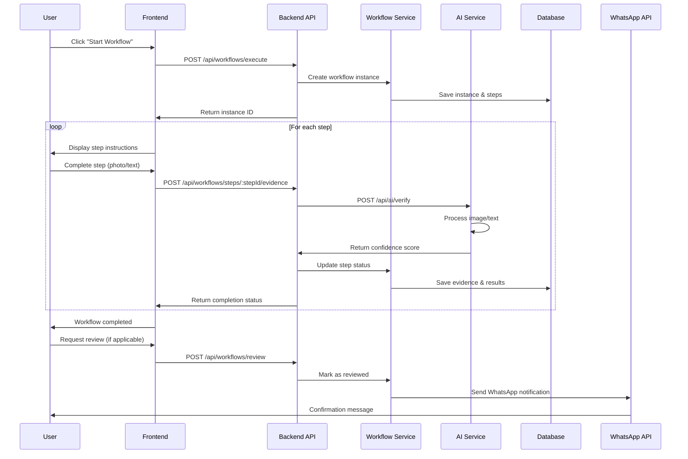
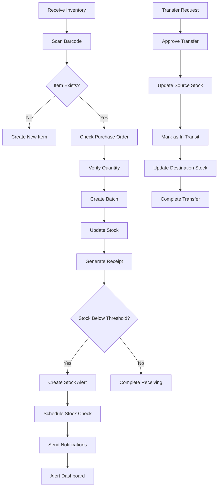
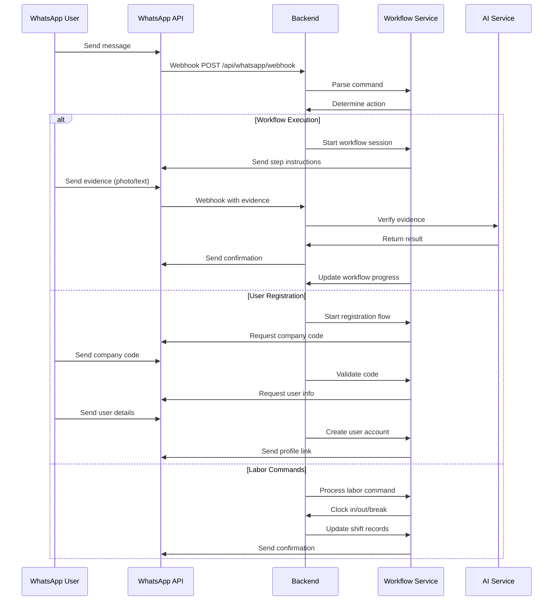
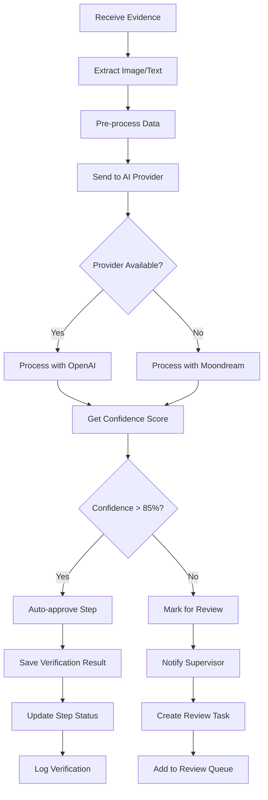
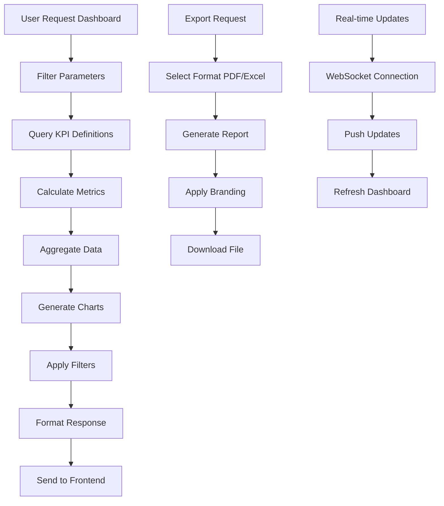

# System Architecture & Workflow Execution Plan

## 🏗️ System Architecture Overview

```mermaid
graph TB
    subgraph "Frontend (Next.js)"
        A[User Interface] --> B[WorkflowExecutor Component]
        A --> C[Review Dashboard]
        A --> D[Inventory Management]
        A --> E[WhatsApp Interface]
        A --> F[Analytics Dashboard]
    end
    
    subgraph "Backend API (Next.js App Router)"
        B --> G[/api/workflows/execute]
        B --> H[/api/workflows/steps]
        C --> I[/api/workflows/review]
        D --> J[/api/inventory]
        D --> K[/api/cron/stock-check]
        E --> L[/api/whatsapp/webhook]
        E --> M[/api/ai/verify]
        F --> N[/api/analytics]
    end
    
    subgraph "Services Layer"
        G --> O[Workflow Execution Service]
        H --> O
        I --> P[Review Service]
        J --> Q[Inventory Service]
        K --> R[Stock Alert Service]
        L --> S[WhatsApp Service]
        M --> T[AI Verification Service]
        N --> U[Analytics Service]
    end
    
    subgraph "External Integrations"
        S --> W[WASENDER API]
        T --> X[OpenAI/Moondream]
        Q --> Y[Cloudflare R2]
        U --> Z[PDF/Excel Export]
    end
    
    subgraph "Database (PostgreSQL)"
        O --> A1[workflow_instances]
        O --> A2[workflow_instance_steps]
        P --> A1
        P --> A2
        Q --> B1[inventory_items]
        Q --> B2[inventory_batches]
        Q --> B3[inventory_movements]
        R --> B1
        R --> B2
        S --> C1[whatsapp_sessions]
        S --> C2[whatsapp_messages]
        T --> D1[verification_logs]
        U --> E1[kpi_definitions]
        U --> E2[kpi_values]
    end
    
    subgraph "Storage"
        Y --> F1[R2 Storage]
        F1 --> G1[Document Files]
        F1 --> G2[Evidence Photos]
    end
```

## 🔄 Workflow Execution Flow



## 📊 Inventory Management Flow



## 💬 WhatsApp Integration Flow



## 🔍 AI Verification Process



## 📈 Analytics Dashboard Flow



## 🔐 Security & Performance Considerations

### Security Measures
- **Rate Limiting**: 100 requests/minute per user
- **Authentication**: JWT tokens with 15min expiry
- **Authorization**: Role-based access control
- **Data Encryption**: PII data encrypted at rest
- **Audit Logging**: All actions logged for compliance

### Performance Optimizations
- **Caching**: Redis for frequently accessed data
- **Database Indexes**: Optimized queries for large datasets
- **Pagination**: Efficient data loading for tables
- **Lazy Loading**: Components loaded on demand
- **CDN**: Static assets served via CDN

### Scalability Features
- **Multi-tenant**: Data isolation by company/branch
- **Microservices**: Services can be scaled independently
- **Load Balancing**: Even distribution of requests
- **Database Sharding**: Horizontal scaling for large datasets
- **Auto-scaling**: AWS/GCP auto-scaling groups

---

*This architecture document outlines the technical foundation for implementing the features identified in the user stories audit. The system is designed to be scalable, secure, and maintainable while meeting the compliance requirements for the HORECA industry.*