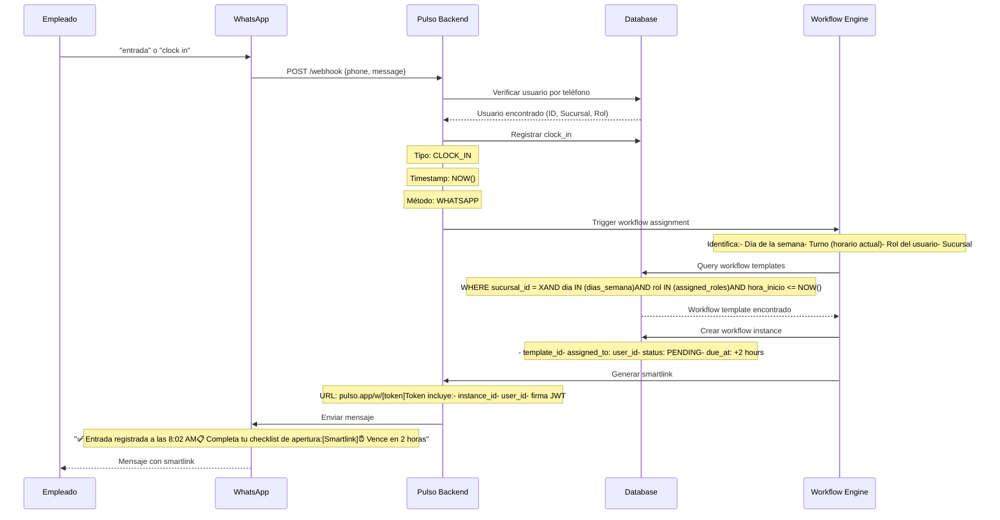
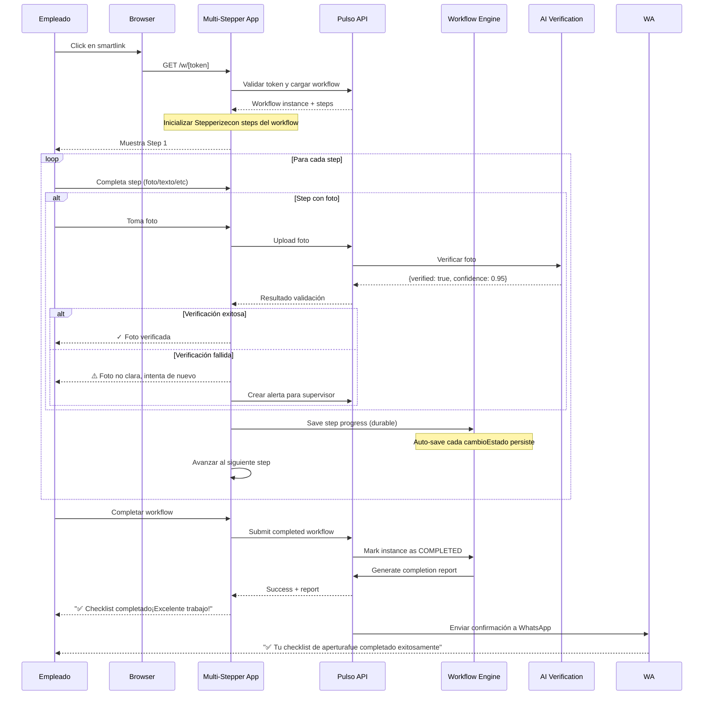
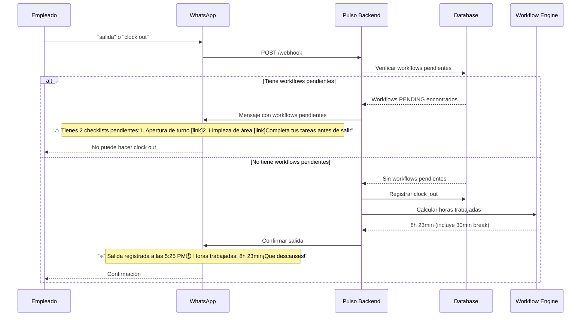
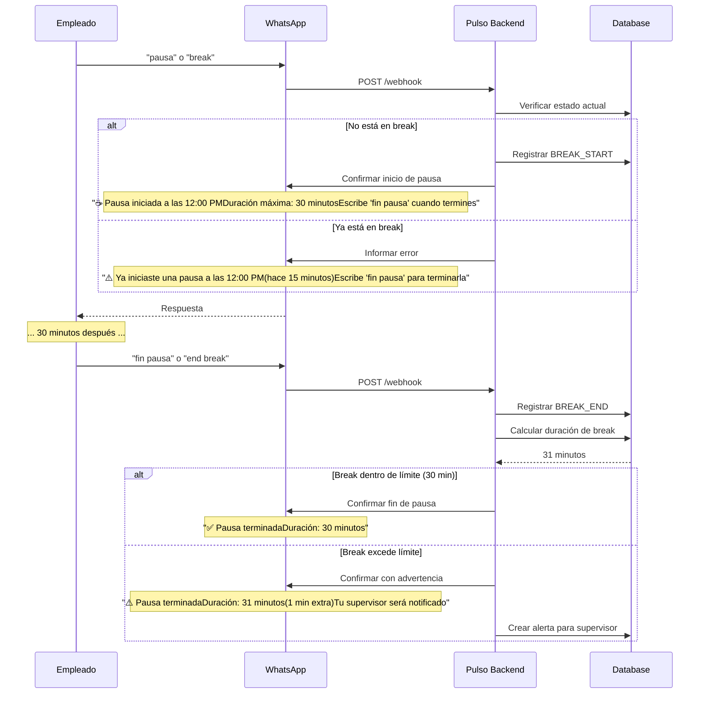

## 6. Feature Specifications

### 6.1 CORE SYSTEM: Workflow Engine

This is the foundation - everything else builds on top of this.

#### 6.1.1 Workflow Template Builder

**Priority:** P0 (Critical - MVP)  
**User Story:** As a manager, I want to create custom workflows for any operational process

**Core Capabilities:**
- Drag-and-drop visual builder
- Step types: text input, number, yes/no, multiple choice, photo, signature, checklist, timer
- Configure per step:
  - Title, description, instructions
  - Required vs optional
  - Validation rules (min/max, regex, etc.)
  - AI verification settings (for photo steps)
  - Conditional logic (if X then show Y)
- Save as template for reuse
- Duplicate and customize existing templates
- Version control (track changes over time)

**Technical Requirements:**
- JSON-based workflow definition schema
- Template storage in `flow_templates` table
- Validation with Zod schemas
- Support for 100+ steps per workflow (though typically 5-15)

**UI/UX Requirements:**
- Left panel: Step library (drag from here)
- Center panel: Workflow canvas (drop here, reorder)
- Right panel: Step configuration (when step selected)
- Top bar: Save, preview, publish actions
- Mobile-responsive (though builder is desktop-first)

---

#### 6.1.2 Workflow Execution Engine

**Priority:** P0 (Critical - MVP)  
**User Story:** As an employee, I want to complete assigned workflows step-by-step

**Core Capabilities:**
- Display workflow instance with all steps
- Navigate between steps (next, back, jump to specific)
- Collect input based on step type
- Upload evidence (photos, signatures, etc.)
- Auto-save progress every 30 seconds
- Resume interrupted workflows
- Mark workflow as complete
- View completed workflows with all evidence

**Step Execution Flow:**
```
1. User opens workflow instance
2. System shows step 1 of N
3. User provides required input/evidence
4. System validates input (client-side first)
5. If photo step + AI enabled:
   - Upload photo to R2
   - Call AI verification API
   - Show verification result
   - If failed, allow retake
6. Save step response to database
7. System shows step 2 of N
8. Repeat until all steps complete
9. User confirms completion
10. System marks workflow as complete
```

**Technical Requirements:**
- Real-time state management (React state + backend sync)
- Optimistic UI updates with rollback on failure
- Photo upload with compression (max 2MB per photo)
- Offline support with queue sync (PWA)
- Progress indicator accurate to step level

---

#### 6.1.3 Template Library & Marketplace

**Priority:** P1 (High - Post-MVP)  
**User Story:** As a new user, I want to find pre-built templates relevant to my industry

**Core Capabilities:**
- Browse templates by category:
  - Compliance (NOM-251, NOM-035, Labor Law)
  - Operations (Opening, Closing, Cleaning, Quality Control)
  - Industry-specific (Restaurant, Café, Hotel, etc.)
- Preview template steps before importing
- Import template to my workspace
- Customize imported template
- Search templates by keyword
- Rate and review templates (future: community templates)

**NOM-251 Pre-built Templates:**
1. **Daily Opening Checklist**
   - Equipment temperature verification (fridges, freezers)
   - Visual cleanliness inspection
   - Hand wash station check
   - Pest control verification
   - Critical equipment function test

2. **Daily Closing Checklist**
   - Final temperature logs
   - Food storage verification (all items covered, labeled, dated)
   - Cleaning and sanitization
   - Waste disposal verification
   - Security check

3. **Food Receiving Protocol**
   - Supplier verification
   - Temperature check on delivery
   - Visual inspection (freshness, packaging)
   - Lot number and expiration recording
   - Storage immediately after receipt

4. **Temperature Monitoring**
   - Morning temperature readings (all equipment)
   - Mid-day spot checks
   - Evening final readings
   - Alert if outside safe range (0-4°C for refrigeration)
   - Corrective action documentation if needed

5. **Cleaning & Sanitization Log**
   - Surface-by-surface cleaning checklist
   - Chemical concentration verification
   - Contact time compliance
   - Before/after photos
   - Staff signature confirmation

6. **Product Expiration Check**
   - Daily walk-through of all storage areas
   - Photo-based expiration date scanning (OCR)
   - FIFO rotation verification
   - Disposal documentation for expired items
   - Near-expiration alerts (5 days out)

7. **Cross-Contamination Prevention**
   - Cutting board color-coding verification
   - Utensil separation checklist
   - Allergen handling protocol
   - Staff handwashing compliance
   - Storage zone separation check

8. **Pest Control Verification**
   - Weekly trap inspection
   - Evidence of pest activity check
   - Entry point sealing verification
   - Contractor visit documentation
   - Corrective action log

9. **Equipment Calibration Check**
   - Thermometer calibration (monthly)
   - Scale accuracy verification
   - Probe thermometer function test
   - Timer accuracy check
   - Documentation of calibration results

10. **Employee Health & Hygiene**
    - Daily health screening questions
    - Uniform cleanliness check
    - Jewelry/accessories removal verification
    - Wound covering protocol
    - Illness reporting documentation

**NOM-035 Pre-built Templates:**
1. **Psychosocial Risk Assessment (Initial)**
   - 72-question employee survey
   - Anonymous responses
   - Auto-scoring by risk category
   - Report generation for STPS

2. **Psychosocial Risk Assessment (Follow-up)**
   - Shortened 46-question survey
   - Conducted annually after initial
   - Trend comparison to previous assessment
   - Intervention recommendations

3. **Violence & Harassment Event Report**
   - Incident documentation
   - Witness statements
   - Evidence collection (photos, messages)
   - Investigation tracking
   - Resolution documentation

4. **Workplace Environment Survey**
   - Quarterly pulse check (10 questions)
   - Temperature check on work environment
   - Early warning signs of issues
   - Manager action items based on results

**Labor Law Pre-built Templates:**
1. **Daily Attendance & Hours**
   - Clock in/out with geolocation
   - Break start/end logging
   - Overtime approval workflow
   - Manager verification

2. **Break Compliance Tracker**
   - Auto-reminder at 4 hours worked
   - Break start/end logging
   - Duration calculation
   - Compliance alert if not taken

3. **Overtime Request & Approval**
   - Employee submits OT request
   - Manager approves/rejects
   - Auto-calculation of OT hours
   - Weekly limit warnings

4. **Employee Document Checklist**
   - List of required documents per employee
   - Upload interface for each document
   - Expiration tracking
   - Renewal reminders

---

### 6.2 COMPLIANCE INTELLIGENCE: Auto-Detection & Reporting

This is what makes Pulso special - we understand compliance without the user having to.

#### 6.2.1 Compliance Template Tagging

**Priority:** P1 (High - MVP or Phase 1)  
**User Story:** As a system, I need to know which workflows are compliance-related

**How It Works:**
- Each workflow template has optional metadata:
  ```json
  {
    "complianceType": "NOM-251" | "NOM-035" | "LABOR_LAW" | null,
    "regulationSection": "5.1.2", // specific section of regulation
    "requiredFrequency": "daily" | "weekly" | "monthly" | "annual",
    "auditable": true, // include in audit reports
    "evidenceRequired": true, // must have photo/signature evidence
    "criticalForCompliance": true // missing this = compliance violation
  }
  ```

- Pre-built NOM templates have this filled in automatically
- Custom workflows default to `complianceType: null` (non-compliance)
- Users can optionally mark custom workflows as compliance-related

**Why This Matters:**
- System knows which workflows to include in audit reports
- Can calculate compliance scores (% of required workflows completed)
- Generates alerts for missed critical compliance workflows
- Filters compliance vs operational data in reports

---

#### 6.2.2 Compliance Report Generator

**Priority:** P1 (High - MVP or Phase 1)  
**User Story:** As an owner, I want to generate an audit-ready report in 1 click

**Report Types:**

**A) NOM-251 Audit Report (COFEPRIS)**

Contents:
- Cover page: Business info, period covered, certification statement
- Executive Summary:
  - Total compliance workflows completed
  - Completion rate by category
  - Critical violations (if any)
  - Corrective actions taken
- Detailed Evidence Log:
  - All temperature readings with timestamps
  - All cleaning logs with before/after photos
  - All food receiving logs with supplier info
  - All expiration checks with OCR results
- Appendices:
  - Employee training records
  - Equipment calibration logs
  - Pest control contractor reports
- Footer: Digital signatures, timestamp, verification hash

**B) NOM-035 Psychosocial Risk Report (STPS)**

Contents:
- Cover page: Business info, assessment period
- Methodology: Survey details, sample size, response rate
- Results by Risk Category:
  - Environment and organizational factors
  - Excessive workload demands
  - Lack of work-life balance
  - Leadership and workplace relationships
  - Violence at work
- Risk Level Classification:
  - Null/No risk
  - Low risk
  - Medium risk
  - High risk
  - Very high risk
- Intervention Plan:
  - Identified issues
  - Proposed actions
  - Timeline
  - Responsible parties
- Follow-up Schedule

**C) Labor Law Compliance Report**

Contents:
- Work Hours Summary (per employee):
  - Total hours worked
  - Regular hours
  - Overtime hours (by type: 2x, 3x)
  - Days worked
  - Days of rest
- Break Compliance:
  - Required breaks per employee
  - Breaks actually taken
  - Compliance %
  - Violations (if any)
- Document Completeness:
  - Employee roster
  - Documents on file per employee
  - Missing documents flagged
  - Expiration alerts
- Compliance Score: Overall % for period

**Technical Implementation:**
- Backend: Generate PDF using a library like `pdf-lib` or `puppeteer`
- Templates: HTML/CSS templates for each report type
- Data aggregation: SQL queries to pull relevant workflow completions
- Evidence: Include photos inline (compressed) or as appendix
- Export formats: PDF (primary), Excel (data export), CSV (raw data)

**API Endpoints:**
```typescript
POST /api/reports/compliance/generate
{
  "reportType": "NOM-251" | "NOM-035" | "LABOR_LAW",
  "dateRange": { "start": "2026-01-01", "end": "2026-01-31" },
  "branchIds": ["uuid1", "uuid2"], // optional, default all
  "includeEvidence": true, // include photos inline
  "format": "pdf" | "excel" | "csv"
}

Response:
{
  "reportId": "uuid",
  "downloadUrl": "https://r2.../report.pdf",
  "expiresAt": "2026-02-15T00:00:00Z" // 30 days
}
```

---

#### 6.2.3 Compliance Dashboard & Scoring

**Priority:** P2 (Medium - Post-MVP)  
**User Story:** As an owner, I want to see my compliance health at a glance

**Dashboard Widgets:**

1. **Overall Compliance Score**
   - Calculation: (Completed critical workflows / Required critical workflows) × 100
   - Color coding: Green (>95%), Yellow (85-95%), Red (<85%)
   - Trend: Compare to previous period

2. **NOM-251 Compliance Meter**
   - Categories: Temperature monitoring, Cleaning, Receiving, Expiration checks
   - Score per category
   - Missing workflows highlighted

3. **NOM-035 Status**
   - Last assessment date
   - Next assessment due
   - Risk level: Low, Medium, High
   - Action items pending

4. **Labor Law Compliance**
   - Work hours violations: Count of employees over 48h
   - Overtime violations: Count of excessive OT
   - Break violations: Count of missed breaks
   - Document gaps: Count of missing docs

5. **Audit Readiness Score**
   - Based on: Workflow completion, Evidence quality, Timeliness
   - Simulation: "If audited today, you would..."
   - Recommendations: "Complete X workflows to reach 100%"

6. **Upcoming Compliance Tasks**
   - Tasks due today
   - Tasks due this week
   - Overdue tasks (red alert)

**Alerts:**
- Critical: Missed workflows that create compliance violations
- Warning: Workflows at risk of becoming overdue
- Info: Upcoming compliance deadlines (e.g., annual assessment due)

---

### 6.3 INVENTORY SYSTEM (with Compliance Integration)

This is still part of the original plan, but we frame it with compliance benefits.

#### 6.3.1 Product & Inventory Management

**Priority:** P1 (High - Phase 2)  
**User Story:** As a manager, I want to track inventory to reduce waste and prove compliance

**Core Features:**
- Product catalog with detailed info:
  - Name, SKU, barcode, category
  - Allergen information (for NOM-251 compliance)
  - Storage requirements (temperature, humidity)
  - Typical shelf life
  - Supplier information
- Inventory tracking by branch:
  - Current quantity
  - Min/max levels
  - Location within facility
  - Status (available, reserved, expired, quarantined)
- Batch/lot tracking:
  - Lot number
  - Production date
  - Expiration date
  - Quantity remaining
  - Supplier batch info
- Inventory movements:
  - Type: Receiving, usage, adjustment, transfer, waste
  - Linked to workflow when applicable
  - Automatic updates from receiving workflows
  - Full audit trail

**Compliance Integration:**
- NOM-251 requirement: All food must be traceable by lot
- Workflow integration: Receiving workflows auto-update inventory
- Expiration tracking: Alert 5 days before expiration (NOM-251)
- FIFO enforcement: System suggests oldest lot first
- Waste documentation: Required for food safety audits

**API Endpoints:**
```typescript
// Products
POST /api/products - Create product
GET /api/products - List products (paginated, filterable)
GET /api/products/:id - Get product details
PATCH /api/products/:id - Update product
DELETE /api/products/:id - Archive product

// Inventory
GET /api/inventory?sucursalId=X - Get inventory levels
POST /api/inventory/movements - Record movement
GET /api/inventory/expiring?days=5 - Get items expiring soon
GET /api/inventory/lots?productId=X - Get lots for product

// Batches
POST /api/inventory/batches - Create lot/batch
GET /api/inventory/batches/:id - Get batch details
PATCH /api/inventory/batches/:id - Update batch (e.g., quantity used)
```

---

#### 6.3.2 AI-Powered Expiration Detection

**Priority:** P1 (High - Phase 2)  
**User Story:** As an employee, I want to scan expiration dates automatically

**How It Works:**
1. Employee executes "Daily Expiration Check" workflow
2. For each product area (walk-in, dry storage, etc.):
   - Take photo of products
   - AI extracts expiration dates using OCR
   - System matches products to inventory
   - Flags items expiring in <5 days
3. Employee confirms or corrects AI results
4. System generates report of items to use/discard

**AI Implementation:**
- Primary: Moondream for fast OCR ($0.001/image)
- Fallback: OpenAI GPT-4V for unclear labels ($0.01/image)
- Training: Fine-tune on Mexican product labels
- Validation: Confidence threshold 85%+ for auto-approval

**Compliance Value:**
- NOM-251 requires monitoring expiration dates
- Automated log = audit evidence
- Prevents serving expired food (health violation)
- Reduces waste (cost savings)

---

#### 6.3.3 Inventory Alerts & Automation

**Priority:** P2 (Medium - Phase 2)  
**User Story:** As a manager, I want automatic alerts for inventory issues

**Alert Types:**

1. **Low Stock Alert**
   - Trigger: Current quantity < min threshold
   - Notification: WhatsApp, email, in-app
   - Action: Suggest creating purchase order
   - Frequency: Once daily (not spam)

2. **Expiration Warning**
   - Trigger: Product expiring in 5 days
   - Notification: WhatsApp (to manager + chef)
   - Action: Suggest menu items to use product
   - Frequency: Daily at 8am

3. **Expired Product Alert**
   - Trigger: Product past expiration date
   - Notification: Critical alert (WhatsApp + in-app)
   - Action: Require disposal workflow
   - Frequency: Immediate

4. **FIFO Violation Warning**
   - Trigger: Newer lot used before older lot
   - Notification: Warning to employee + manager
   - Action: Training reminder
   - Frequency: Real-time

5. **Unusual Usage Pattern**
   - Trigger: Consumption >2x normal rate
   - Notification: Manager alert
   - Action: Investigate potential theft/waste
   - Frequency: Weekly analysis

**Technical Implementation:**
- Background job: Runs hourly to check alert conditions
- Alert queue: Stores pending alerts
- Notification service: Sends via appropriate channel
- Alert history: Track all alerts and resolutions

---

### 6.4 LABOR MANAGEMENT (Compliance-Ready)

#### 6.4.1 Work Hour Tracking

**Priority:** P1 (High - Phase 3)  
**User Story:** As an employee, I want to clock in/out easily

**Core Features:**
- Clock in/out via:
  - Web/mobile app (button click)
  - WhatsApp command ("entrada", "salida")
  - Automatic via workflow (opening/closing workflows auto-clock)
- Capture per punch:
  - Timestamp (server-side, tamper-proof)
  - Geolocation (validate employee is at branch)
  - Method (app, WhatsApp, auto)
  - Associated workflow (if applicable)
- View current status:
  - "Clocked in since 8:02 AM"
  - "Hours worked today: 3h 47m"
  - "Break status: Not taken"
- History view:
  - Daily logs for past 30 days
  - Total hours per week
  - Overtime hours calculated

**Compliance Integration:**
- Federal Labor Law: Requires accurate hour tracking
- Auto-calculation of overtime (>8h/day or >48h/week)
- Break reminders (required by law)
- Export for payroll and labor audits

---

#### 6.4.2 Break Management

**Priority:** P1 (High - Phase 3)  
**User Story:** As a manager, I want to ensure employees take required breaks

**Requirements (Mexican Labor Law):**
- 30 minutes for 8-hour shift
- 15 minutes for 4-6 hour shift
- Breaks don't count as worked time

**Implementation:**
- Auto-reminder after 4 hours worked
- Clock out for break (via app or WhatsApp "pausa")
- Timer shows break duration
- Clock back in after break ("fin pausa")
- Alert if break exceeds 45 minutes (unusual)
- Daily report: Who didn't take required break

---

#### 6.4.3 Overtime Calculation & Alerts

**Priority:** P1 (High - Phase 3)  
**User Story:** As an owner, I need to know when someone is approaching overtime limits

**Mexican Overtime Rules:**
- First 9 hours of weekly OT: 2x pay
- Hours 10+: 3x pay
- Maximum 3 hours OT per day
- Maximum 3 days with OT per week

**System Behavior:**
- Real-time tracking: Calculate OT as hours are logged
- Warning alerts:
  - At 7 hours in a day: "Approaching daily limit"
  - At 45 hours in a week: "Approaching weekly limit"
  - At 8 hours OT in week: "Approaching 2x->3x threshold"
- Manager approval: Required for OT over 2 hours/day
- Violation alerts: Flag illegal OT (>3h/day, >3days/week)

**Reports:**
- Weekly OT summary per employee
- Total OT cost calculation
- Compliance violations (if any)
- Export for payroll system

---

#### 6.4.4 NOM-035 Psychosocial Risk Assessment

**Priority:** P2 (Medium - Phase 3)  
**User Story:** As an HR manager, I need to comply with NOM-035 requirements

**What is NOM-035:**
- Mexican standard for workplace psychosocial risks
- Required for all businesses with 15+ employees
- Mandates: Risk assessment, prevention policy, corrective actions
- Assessment frequency: Every 2 years (or annually if high risk)

**Implementation:**

**Initial Assessment (Questionnaire III - 72 questions):**
- Anonymous digital survey
- Employees complete on their own device
- Takes ~20 minutes
- Categories assessed:
  1. Work environment and organizational factors
  2. Excessive workload
  3. Lack of control over work
  4. Interference work-life
  5. Violent workplace experiences
  6. Leadership and relationships

**Scoring & Risk Classification:**
- Auto-score each category
- Overall risk level: Null, Low, Medium, High, Very High
- Risk distribution by employee demographics (optional)
- Identify high-risk areas requiring intervention

**Report Generation:**
- STPS-compliant report format
- Charts and graphs of results
- Recommendations for intervention
- Action plan template
- Timeline for follow-up assessment

**Follow-up Assessment (Questionnaire II - 46 questions):**
- Conducted annually or after interventions
- Shorter survey, tracks improvements
- Compares to baseline assessment
- Validates effectiveness of interventions

**Compliance Dashboard:**
- Last assessment date
- Next assessment due (countdown)
- Current risk level
- Action items status
- Assessment history

---

### 6.5 WHATSAPP INTEGRATION

This is the "secret weapon" - making everything accessible via WhatsApp.

#### 6.5.1 WhatsApp Setup & Session Management

**Priority:** P0 (Critical - MVP)  
**User Story:** As a company, I want to connect my WhatsApp number to Pulso

**Implementation:** WasenderAPI (Multi-Tenant)

**Setup Flow:**
1. Admin goes to Settings > WhatsApp Integration
2. Clicks "Connect WhatsApp"
3. System creates isolated session for this company via WasenderAPI API
4. Admin scans QR code with WhatsApp (browser or mobile)
5. Session connected, status shows "Active"
6. System registers webhook for incoming messages

**Session Management:**
- Each company has isolated WhatsApp session (via WasenderAPI)
- Session status monitoring (connected, disconnected, expired)
- Auto-reconnect on temporary disconnection
- Alert admin if session fails
- Session logs for debugging

**Technical Details:**
- WasenderAPI API endpoints:
  - POST /session/create - Create company session
  - GET /session/status/:sessionId - Check status
  - POST /session/qr/:sessionId - Get QR code
  - DELETE /session/:sessionId - Disconnect
- Webhook endpoint: POST /api/whatsapp/webhook
  - Receives all incoming messages
  - Routes to correct company based on session
  - Processes message and sends response

---

#### 6.5.2 WhatsApp Command Parser & NLU

**Priority:** P0 (Critical - MVP)  
**User Story:** As an employee, I want to interact with Pulso via simple WhatsApp messages

**Supported Commands:**

**Labor Commands:**
- `entrada`, `clock in`, `entrar` → Clock in
- `salida`, `clock out`, `salir` → Clock out
- `pausa`, `break`, `descanso` → Start break
- `fin pausa`, `end break`, `volver` → End break
- `horas`, `status`, `resumen` → Show today's summary

**Workflow Commands:**
- `tareas`, `pendientes`, `workflows` → Show pending workflows
- `completar [ID]`, `hacer [ID]` → Start specific workflow
- Workflow execution via conversational flow (see next section)

**Info Commands:**
- `ayuda`, `help`, `comandos` → Show command list
- `soporte`, `support` → Contact support
- `perfil`, `profile` → Show user info

**Natural Language Understanding:**
- Parse variations of commands (Spanish + English + Spanglish)
- Handle typos and abbreviations
- Extract parameters (e.g., "pausa de 15 minutos")
- Fallback: Ask clarifying questions if unclear

**Example Conversation:**
```
Employee: "entrada"
Bot: ✅ Entrada registrada a las 8:05 AM
     📍 Sucursal: Centro
     ⏱️ Horas trabajadas hoy: 0h 0m

Employee: "tareas"
Bot: 📋 Tienes 2 tareas pendientes:
     1️⃣ Checklist de Apertura (vence en 25 min)
     2️⃣ Verificación de Temperaturas (vence a las 12:00 PM)
     
     Responde con el número para empezar.

Employee: "1"
Bot: 🌅 Checklist de Apertura
     Paso 1 de 8: Verifica temperatura de refrigeradores
     
     Por favor envía una foto de los termómetros.
```

---

#### 6.5.3 Workflow Execution via WhatsApp

**Priority:** P1 (High - MVP)  
**User Story:** As an employee, I want to complete workflows entirely through WhatsApp

**Two Modes:**

**A) Conversational Flow (Text-Based)**
- Bot guides through steps one by one
- Employee responds inline
- Best for: Quick checklists, simple yes/no workflows

**Example:**
```
Bot: Paso 1: ¿Los pisos están limpios?
Employee: sí
Bot: ✅ Registrado. Paso 2: ¿Los baños están surtidos?
Employee: no
Bot: ⚠️ Registrado. Por favor toma acción.
     Paso 3: Toma una foto de las superficies limpias.
Employee: [sends photo]
Bot: 🤖 Verificando foto...
     ✅ Foto verificada. Superficies limpias confirmadas.
     Paso 4 de 5...
```

**B) Smart Link (Web-Based)**
- Bot sends link to mobile web interface
- Employee completes workflow in browser
- Best for: Complex workflows, multiple photos, signatures

**Example:**
```
Bot: 📋 Tienes un nuevo checklist asignado:
     "Recepción de Mercancía"
     
     👉 Completa aquí: https://pulso.app/w/abc123
     
     ⏰ Debe completarse antes de las 11:00 AM
```

**Implementation:**
- Smart link is a deep link to PWA
- Link contains workflow instance ID + auth token
- Opens directly to workflow execution screen
- Progress synced between WhatsApp and web
- Completion notification sent back to WhatsApp

**Technical Considerations:**
- Handle media messages (photos, videos, documents)
- Support voice notes for text input (future: transcription)
- Session timeout: 30 minutes of inactivity
- Resume workflow: "Where were we? Continue with step 4?"

---

#### 6.5.4 WhatsApp Notifications & Alerts

**Priority:** P1 (High - MVP)  
**User Story:** As an employee, I want to receive important alerts via WhatsApp

**Notification Types:**

1. **Workflow Assignments**
   ```
   📋 Nueva tarea asignada:
   "Checklist de Apertura"
   
   ⏰ Debe completarse hoy antes de las 9:00 AM
   👉 Empieza aquí: https://pulso.app/w/abc123
   ```

2. **Reminders**
   ```
   ⏰ Recordatorio: Tienes una tarea pendiente
   "Verificación de Temperaturas" vence en 30 minutos
   
   Toca aquí para completar: https://pulso.app/w/def456
   ```

3. **Overdue Alerts**
   ```
   🚨 Tarea VENCIDA:
   "Limpieza de Fin de Turno" debió completarse a las 6:00 PM
   
   Por favor completa cuanto antes.
   ```

4. **Approval/Rejection**
   ```
   ✅ Tu checklist fue APROBADO:
   "Apertura del 15 de Enero"
   
   ¡Buen trabajo! Todo en orden.
   ```
   
   ```
   ❌ Tu checklist fue RECHAZADO:
   "Limpieza del 15 de Enero"
   
   Razón: Fotos de baños no están claras.
   Por favor repite los pasos 3, 4, y 5.
   ```

5. **System Alerts**
   ```
   ⚠️ ALERTA: Producto próximo a caducar
   "Leche entera 1L" caduca en 3 días
   
   Sugerencia: Úsalo en el menú especial de mañana.
   ```

**Notification Preferences:**
- User configures per notification type:
  - WhatsApp: Yes/No
  - Email: Yes/No
  - In-app: Yes/No (always on)
- Quiet hours: No notifications outside work hours
- Urgency levels: Critical (always send), Normal (respect quiet hours)

**Rate Limiting:**
- Max 10 notifications per user per day
- Group similar notifications (e.g., "3 tasks due today")
- Avoid spam with intelligent batching

---

### 6.6 ANALYTICS & REPORTING

#### 6.6.1 Operational Dashboard

**Priority:** P1 (High - MVP)  
**User Story:** As a manager, I want to see real-time status of operations

**Widgets:**

1. **Workflow Completion Rate**
   - Formula: (Completed workflows / Scheduled workflows) × 100
   - Time periods: Today, This Week, This Month
   - Trend: ↗️ Improving, ↘️ Declining, → Stable
   - Chart: Line graph of completion rate over time

2. **On-Time Completion Rate**
   - Formula: (Completed before due time / Total completed) × 100
   - Target: 90%+
   - Chart: Stacked bar (on-time vs late)

3. **Active Workflows**
   - Count of workflows in progress right now
   - Breakdown by status: Not started, In progress, Overdue
   - List: Shows next 5 due workflows with countdown timers

4. **Alert Summary**
   - Count by priority: Critical, High, Medium, Low
   - Unresolved alerts only
   - Click to see alert details

5. **Employee Activity**
   - Who's clocked in right now
   - Who completed most workflows today (leaderboard)
   - Average time per workflow by employee

6. **Branch Comparison** (multi-branch view)
   - Completion rate by branch
   - Alerts by branch
   - Top and bottom performers

**Filters:**
- Date range: Today, Yesterday, Last 7 days, Last 30 days, Custom
- Branch: All branches or specific branch
- Workflow type: All, Compliance, Operations

---

#### 6.6.2 Compliance Reports (Detailed)

**(Already covered in section 6.2.2, but listing API here for reference)**

**API Endpoints:**
```typescript
// Generate compliance report
POST /api/reports/compliance
{
  "type": "NOM-251" | "NOM-035" | "LABOR_LAW",
  "period": { "start": "2026-01-01", "end": "2026-01-31" },
  "branchIds": ["# Product Requirements Document (PRD)
# Pulso - Compliance-First Operations Platform

**Version:** 2.0 (Hybrid Model)  
**Date:** January 15, 2026  
**Document Owner:** Product Team  
**Status:** In Progress

---

## Table of Contents

1. [Executive Summary](#executive-summary)
2. [Product Vision & Strategy](#product-vision--strategy)
3. [Market Analysis](#market-analysis)
4. [User Personas](#user-personas)
5. [Product Architecture](#product-architecture)
6. [Feature Specifications](#feature-specifications)
7. [Technical Requirements](#technical-requirements)
8. [Implementation Roadmap](#implementation-roadmap)
9. [Success Metrics](#success-metrics)
10. [Go-to-Market Strategy](#go-to-market-strategy)

---

## 1. Executive Summary

### 1.1 Product Overview

Pulso is a **Compliance-First Operations Platform** specifically designed for the Mexican HORECA industry. Unlike generic workflow tools, Pulso ensures regulatory compliance (NOM-251, NOM-035, Federal Labor Law) while simultaneously reducing operational waste and automating daily operations.

### 1.2 Core Value Propositions

**PRIMARY (Compliance Layer):**
- **Never fail a COFEPRIS audit again**: Automatic documentation of temperatures, cleaning, and food safety protocols
- **Avoid STPS fines**: Automated labor law compliance with work hours, breaks, and overtime tracking
- **Audit-ready reports in 1 click**: Generate compliance reports for inspections instantly

**SECONDARY (Operations Layer):**
- **Reduce food waste by 30%**: AI-powered expiration detection and FIFO rotation
- **Save 10+ hours/week**: Eliminate paper checklists and manual documentation
- **WhatsApp-native**: No app downloads, works where your team already is

### 1.3 Key Differentiators

| Feature | Pulso | Generic Tools (Notion, Monday) | Restaurant POS (Toast, Aloha) |
|---------|-------|-------------------------------|------------------------------|
| Mexican compliance built-in | ✅ NOM-251, NOM-035, LFT | ❌ Manual configuration | ⚠️ Limited |
| AI-powered verification | ✅ Photo OCR + validation | ❌ None | ❌ None |
| WhatsApp-native execution | ✅ Full workflow support | ⚠️ Notifications only | ❌ None |
| Audit report generation | ✅ 1-click PDF/Excel | ❌ Manual export | ⚠️ Basic only |
| ROI tracking dashboard | ✅ Waste prevention metrics | ❌ None | ⚠️ Sales only |

### 1.4 Business Model

**Pricing Tiers:**
- **Compliance Básico**: $299 MXN/month/branch (~$15 USD)
- **Compliance + Ahorros**: $599 MXN/month/branch (~$30 USD)
- **Enterprise**: $999 MXN/month/branch (~$50 USD)

**Target Market:**
- Primary: Independent restaurants with 1-5 locations (80% of market)
- Secondary: Small chains with 5-20 locations (15% of market)
- Tertiary: Large chains 20+ locations (5% of market, highest ACV)

**Revenue Goals:**
- Month 6: $25K USD MRR (50 customers, avg 2.5 branches)
- Month 12: $100K USD MRR (200 customers)
- Month 24: $500K USD MRR (1,000 customers)

---

## 2. Product Vision & Strategy

### 2.1 Vision Statement

> "To make regulatory compliance effortless and profitable for every restaurant in Latin America, transforming compliance from a cost center into a competitive advantage."

### 2.2 Strategic Positioning

**The Simplified Strategy:**

```
┌─────────────────────────────────────────────────────────┐
│        CORE PRODUCT: Workflow Builder + Execution       │
├─────────────────────────────────────────────────────────┤
│ • Drag-and-drop workflow builder (like current Pulso)  │
│ • Execute workflows via web/mobile/WhatsApp             │
│ • AI verification for photo steps                      │
│ • Evidence storage with timestamps                     │
│ • Multi-tenant, multi-branch support                   │
└─────────────────────────────────────────────────────────┘
                          ↓
┌─────────────────────────────────────────────────────────┐
│    COMPLIANCE ADD-ON: Pre-built NOM Templates          │
├─────────────────────────────────────────────────────────┤
│ ✅ NOM-251 Templates (10+ workflows pre-configured)    │
│ ✅ NOM-035 Templates (psychosocial risk assessment)    │
│ ✅ Labor Law Templates (breaks, overtime tracking)     │
│ ✅ Compliance Reports (PDF/Excel for audits)           │
│                                                         │
│ Users can:                                             │
│ • Use templates as-is                                  │
│ • Customize templates to their needs                   │
│ • Create 100% custom workflows                         │
│ • Mix compliance + operational workflows               │
└─────────────────────────────────────────────────────────┘
                          ↓
┌─────────────────────────────────────────────────────────┐
│      REPORTING LAYER: Compliance Intelligence          │
├─────────────────────────────────────────────────────────┤
│ • Standard operational reports (completion rates, etc.) │
│ • Compliance-specific reports:                         │
│   ├─ NOM-251 Audit Report (COFEPRIS-ready)            │
│   ├─ NOM-035 Assessment Report (STPS-ready)           │
│   ├─ Labor Law Compliance Report                      │
│   └─ Evidence Log (all photos/timestamps)              │
│                                                         │
│ • Auto-detect which workflows are compliance-related   │
│ • Generate audit reports filtering compliance data     │
│ • Export with official formats and signatures          │
└─────────────────────────────────────────────────────────┘
```

**Key Insight:** We're NOT building a compliance-only tool. We're building a **flexible workflow platform with compliance intelligence baked in**.

### 2.3 Product Philosophy

**"Flexible Workflows with Compliance Intelligence"**

We are NOT:
- ❌ A compliance-only tool (too narrow, low engagement)
- ❌ A generic workflow builder without domain expertise (no differentiation)
- ❌ A rigid system that forces one way of working

We ARE:
- ✅ **A workflow platform** that lets you build ANY operational process
- ✅ **With compliance expertise** via pre-built NOM templates
- ✅ **Plus smart reporting** that auto-generates audit documentation

**Design Principle:** "Maximum flexibility, intelligent defaults"

- **For compliance-focused customers:** Use our NOM templates out-of-box, generate audit reports
- **For operations-focused customers:** Build custom workflows, ignore compliance features
- **For both:** Mix pre-built compliance templates with custom operational workflows

**The Magic:** Behind the scenes, we track which workflows are compliance-related and auto-generate proper audit documentation without the user thinking about it.

### 2.4 Competitive Moat

Our defensibility comes from:

1. **Regulation Expertise**: Deep knowledge of Mexican HORECA regulations
   - NOM-251-SSA1-2009 (Food safety)
   - NOM-035-STPS-2018 (Psychosocial risks)
   - Federal Labor Law (Ley Federal del Trabajo)

2. **Industry-Specific AI**: Models trained on HORECA-specific images
   - Thermometer OCR optimized for kitchen equipment
   - Food expiration label detection
   - Cleanliness assessment trained on restaurant environments

3. **WhatsApp Integration**: 95% of Mexican workers already use it
   - Zero adoption friction (no new app to learn)
   - Voice notes for illiterate/elderly workers
   - Works on any phone (even old devices)

4. **Network Effects**: Each customer makes the platform smarter
   - Improved AI models from more training data
   - Better workflow templates from usage patterns
   - Compliance updates distributed automatically
markdown

# Pulso - Supervisor Digital de Cumplimiento Operativo
## Product Requirements Document (PRD) v2.0

---

## 📋 Tabla de Contenidos

1. [Visión del Producto](#visión-del-producto)
2. [Problema y Oportunidad](#problema-y-oportunidad)
3. [Propuesta de Valor](#propuesta-de-valor)
4. [Arquitectura del Sistema](#arquitectura-del-sistema)
5. [Flujo de Usuario Principal](#flujo-de-usuario-principal)
6. [Sistema de Workflows Inteligentes](#sistema-de-workflows-inteligentes)
7. [Especificaciones Técnicas](#especificaciones-técnicas)
8. [Roadmap de Implementación](#roadmap-de-implementación)
9. [Casos de Uso Detallados](#casos-de-uso-detallados)
10. [Métricas de Éxito](#métricas-de-éxito)

---

## 🎯 Visión del Producto

**Pulso** es un supervisor digital de cumplimiento operativo diseñado específicamente para cadenas de restaurantes, hoteles y negocios HORECA con 3 a 15 sucursales en México.

### Concepto Central: WhatsApp + Workflows Inteligentes

Pulso transforma WhatsApp en el centro de comando operativo, donde cada empleado puede:
1. **Registrar su entrada/salida y breaks** mediante mensajes simples
2. **Recibir automáticamente un smartlink** personalizado que dispara el workflow específico de su rol, sucursal, turno y día
3. **Ejecutar el workflow** en una webapp multi-step inteligente y persistente
4. **Completar tareas de cumplimiento** sin apps adicionales

### ¿Cómo Funciona?

```
Empleado → WhatsApp: "entrada" 
    ↓
Sistema registra clock-in
    ↓
Sistema identifica: Sucursal + Rol + Turno + Día
    ↓
Sistema genera smartlink único con workflow asignado
    ↓
WhatsApp envía: "✅ Entrada registrada. Completa tu checklist: [smartlink]"
    ↓
Empleado toca el link → Se abre webapp multi-step
    ↓
Empleado completa pasos (fotos, validaciones, firmas)
    ↓
Sistema valida con IA y registra cumplimiento
```

### Diferenciadores Clave

- **WhatsApp como Entrada Universal**: Sin apps adicionales para clock in/out
- **Smartlinks Contextuales**: Cada acción dispara el workflow correcto automáticamente
- **Multi-Stepper Durables**: Workflows persistentes que se pueden pausar y retomar
- **Validación Automática con IA**: Verificación de fotos y cumplimiento en tiempo real
- **Cumplimiento Normativo**: NOM-251, NOM-035, Ley Federal del Trabajo

---

## 🔍 Problema y Oportunidad

### Problema Actual

Las cadenas de restaurantes en México (3-15 sucursales) enfrentan:

1. **Fragmentación de Sistemas**
   - Apps diferentes para asistencia, checklists, inventario
   - Documentación en papel o Excel desorganizado
   - WhatsApp informal sin estructura ni trazabilidad
   - Falta de integración entre sistemas

2. **Cumplimiento Manual Ineficiente**
   - Supervisores revisan manualmente cada foto de evidencia
   - Reportes de cumplimiento tardan días en generarse
   - Difícil detectar patrones de incumplimiento
   - Multas por documentación incompleta

3. **Adopción Baja de Tecnología**
   - Empleados con baja alfabetización digital
   - Resistencia a descargar apps nuevas
   - Interfaces complejas poco intuitivas
   - Capacitación costosa y lenta

4. **Falta de Visibilidad Operativa**
   - Gerentes no saben qué pasa en tiempo real
   - Alertas críticas llegan tarde
   - Imposible comparar sucursales
   - Decisiones basadas en intuición, no datos

### Oportunidad de Mercado

**Mercado Total Direccionable (TAM)**
- 500,000+ establecimientos HORECA en México
- 50,000 cadenas de 3-15 sucursales
- Ticket promedio: $200-500 USD/mes por  cadena

**Mercado Inicial (3-15 sucursales)**
-

**Ventaja Competitiva**
- Única solución que usa WhatsApp como entrada principal
- Workflows inteligentes que se adaptan automáticamente
- IA para validación automática vs supervisión manual
- Precio 60% menor que competencia tradicional

---

## 💡 Propuesta de Valor

### Para Empleados

**Antes**: 
- Descargar 3-4 apps diferentes
- Recordar contraseñas
- Llenar formatos en papel
- Buscar supervisor para firmar

**Después con Pulso**:
- Un mensaje de WhatsApp para todo
- Click en un link para abrir tu checklist
- Guía paso a paso con fotos
- Confirmación inmediata

**Beneficios**:
- ✅ Cero apps adicionales que descargar
- ✅ Interfaz familiar (WhatsApp)
- ✅ Instrucciones claras en cada paso
- ✅ Feedback instantáneo

### Para Supervisores/Gerentes

**Antes**:
- Revisar manualmente 50+ fotos diarias
- Perseguir empleados para completar tareas
- Generar reportes manualmente en Excel
- Esperar días para ver cumplimiento

**Después con Pulso**:
- IA revisa y valida automáticamente
- Alertas automáticas de incumplimiento
- Dashboard en tiempo real
- Reportes generados automáticamente

**Beneficios**:
- ✅ 80% menos tiempo en supervisión manual
- ✅ Detección inmediata de problemas críticos
- ✅ Visibilidad completa de todas las sucursales
- ✅ Cumplimiento normativo garantizado

### Para Dueños/Directores

**Antes**:
- Sin visibilidad de operación diaria
- Multas por incumplimiento normativo
- Costos ocultos de ineficiencia
- Decisiones basadas en intuición

**Después con Pulso**:
- Dashboard ejecutivo en tiempo real
- Cumplimiento normativo automatizado
- Métricas operativas accionables
- Decisiones basadas en datos

**Beneficios**:
- ✅ Reducción 50% en tiempo de auditoría
- ✅ Evitar multas ($50K-500K MXN)
- ✅ Optimización de operaciones
- ✅ Escalabilidad sin perder control

---

## 🏗️ Arquitectura del Sistema

### Componentes Principales

```
┌─────────────────────────────────────────────────────────┐
│                    PULSO SYSTEM                         │
├─────────────────────────────────────────────────────────┤
│                                                         │
│  ┌──────────────┐      ┌──────────────┐               │
│  │   WhatsApp   │──────│  WA Gateway  │               │
│  │   Business   │      │ (WASENDER)   │               │
│  └──────────────┘      └──────┬───────┘               │
│                               │                         │
│  ┌────────────────────────────┼────────────────────┐   │
│  │        Pulso Backend       │                    │   │
│  │                           ▼                     │   │
│  │  ┌──────────────────────────────────────────┐  │   │
│  │  │      Workflow Orchestrator               │  │   │
│  │  │      (Vercel Workflow DevKit)            │  │   │
│  │  │  - Clock In/Out Handler                  │  │   │
│  │  │  - Workflow Trigger Engine               │  │   │
│  │  │  - Smartlink Generator                   │  │   │
│  │  │  - State Management (Durable)            │  │   │
│  │  └──────────────┬───────────────────────────┘  │   │
│  │                 │                               │   │
│  │                 ▼                               │   │
│  │  ┌──────────────────────────────────────────┐  │   │
│  │  │      Business Logic Layer                │  │   │
│  │  │  - Workflow Assignment Logic             │  │   │
│  │  │  - Role/Shift/Branch Matcher             │  │   │
│  │  │  - Validation Engine                     │  │   │
│  │  │  - AI Verification Service               │  │   │
│  │  │  - Alert/Escalation System               │  │   │
│  │  └──────────────┬───────────────────────────┘  │   │
│  │                 │                               │   │
│  │                 ▼                               │   │
│  │  ┌──────────────────────────────────────────┐  │   │
│  │  │      Database Layer                      │  │   │
│  │  │  (PostgreSQL + Drizzle ORM)              │  │   │
│  │  │  - Multi-tenant Architecture             │  │   │
│  │  │  - Workflow Templates                    │  │   │
│  │  │  - Workflow Instances                    │  │   │
│  │  │  - Time Records (Clock In/Out)           │  │   │
│  │  │  - Evidence Storage (Photos, Data)       │  │   │
│  │  └──────────────────────────────────────────┘  │   │
│  └─────────────────────────────────────────────────┘   │
│                                                         │
│  ┌─────────────────────────────────────────────────┐   │
│  │        Multi-Stepper Webapp                     │   │
│  │        (Stepperize + React)                     │   │
│  │                                                 │   │
│  │  ┌───────────────────────────────────────────┐ │   │
│  │  │  Dynamic Workflow Renderer                │ │   │
│  │  │  - Loads workflow from smartlink         │ │   │
│  │  │  - Renders steps dynamically             │ │   │
│  │  │  - Handles different step types          │ │   │
│  │  │  - Auto-saves progress                   │ │   │
│  │  └───────────────────────────────────────────┘ │   │
│  │                                                 │   │
│  │  ┌───────────────────────────────────────────┐ │   │
│  │  │  Step Components                          │ │   │
│  │  │  - Photo Capture                         │ │   │
│  │  │  - Text/Number Input                     │ │   │
│  │  │  - Multiple Choice                       │ │   │
│  │  │  - Checklist                             │ │   │
│  │  │  - Signature                             │ │   │
│  │  │  - Timer/Temperature                     │ │   │
│  │  └───────────────────────────────────────────┘ │   │
│  └─────────────────────────────────────────────────┘   │
│                                                         │
│  ┌─────────────────────────────────────────────────┐   │
│  │        Admin Dashboard                          │   │
│  │  - Workflow Builder                             │   │
│  │  - Real-time Monitoring                         │   │
│  │  - Compliance Reports                           │   │
│  │  - User Management                              │   │
│  └─────────────────────────────────────────────────┘   │
└─────────────────────────────────────────────────────────┘

┌─────────────────────────────────────────────────────────┐
│              External Services                          │
├─────────────────────────────────────────────────────────┤
│  - WASENDER API (WhatsApp Business)                     │
│  - Moondream AI (Photo Verification)                    │
│  - Cloudflare R2 (File Storage)                         │
│  - Upstash Redis (Caching)                              │
│  - NeonDB (PostgreSQL Hosting)                          │
└─────────────────────────────────────────────────────────┘
```

### Stack Tecnológico

#### Backend
- **Next.js 14+ App Router**: Framework principal
- **Vercel Workflow DevKit**: Orquestación de workflows durables
- **Drizzle ORM**: ORM type-safe para PostgreSQL
- **Zod**: Validación de schemas
- **PostgreSQL (NeonDB)**: Base de datos principal
- **Redis (Upstash)**: Cache y sesiones

#### Frontend (Multi-Stepper Webapp)
- **React 18+**: Biblioteca UI
- **Stepperize**: Librería multi-step forms
- **Tailwind CSS + Shadcn/ui**: Diseño y componentes
- **TanStack Query**: Data fetching y cache
- **React Hook Form**: Manejo de formularios

#### Integraciones
- **WASENDER API**: WhatsApp Business API
- **Moondream**: IA para verificación de fotos
- **Cloudflare R2**: Almacenamiento de archivos
- **Better Auth (Neon)**: Autenticación

---

## 🔄 Flujo de Usuario Principal

### Flujo 1: Clock In + Workflow Trigger



### Flujo 2: Ejecución de Workflow Multi-Step



### Flujo 3: Clock Out sin Workflow Pendiente



### Flujo 4: Gestión de Breaks



---

## 🔧 Sistema de Workflows Inteligentes

### Arquitectura de Workflows con Workflow DevKit

Pulso utiliza **Vercel Workflow DevKit** para crear workflows durables que:
- Persisten su estado automáticamente
- Se pueden pausar y retomar sin pérdida de datos
- Manejan errores y reintentos automáticamente
- Ejecutan pasos asíncronos de forma confiable

#### Ejemplo de Workflow Durable

```typescript
// workflow-triggers/clock-in.workflow.ts
import { sleep } from "workflow";

export async function handleClockIn(userId: string, branchId: string) {
  "use workflow";
  
  // Step 1: Register clock in
  const timeRecord = await registerClockIn({
    userId,
    branchId,
    type: "CLOCK_IN",
    timestamp: new Date(),
    method: "WHATSAPP"
  });
  
  // Step 2: Identify user context
  const userContext = await getUserContext(userId);
  // Returns: { role, shift, branch }
  
  // Step 3: Find matching workflow
  const workflowTemplate = await findMatchingWorkflow({
    branchId,
    role: userContext.role,
    dayOfWeek: new Date().getDay(),
    currentTime: new Date(),
  });
  
  if (!workflowTemplate) {
    // No workflow assigned for this context
    await sendWhatsAppMessage(userContext.phone, {
      message: "✅ Entrada registrada. No tienes tareas pendientes."
    });
    return { success: true, workflowAssigned: false };
  }
  
  // Step 4: Create workflow instance
  const workflowInstance = await createWorkflowInstance({
    templateId: workflowTemplate.id,
    assignedTo: userId,
    branchId,
    dueAt: addHours(new Date(), 2), // Due in 2 hours
    status: "PENDING"
  });
  
  // Step 5: Generate smartlink
  const smartlink = await generateSmartlink({
    instanceId: workflowInstance.id,
    userId,
    expiresIn: "4 hours"
  });
  
  // Step 6: Send WhatsApp notification
  await sendWhatsAppMessage(userContext.phone, {
    message: `✅ Entrada registrada a las ${formatTime(timeRecord.timestamp)}

📋 Completa tu checklist de ${workflowTemplate.nombre}:
${smartlink}

⏰ Vence en 2 horas`,
  });
  
  // Step 7: Schedule reminder (1.5 hours later)
  await sleep("1.5 hours");
  
  // Check if workflow is still pending
  const currentStatus = await getWorkflowStatus(workflowInstance.id);
  
  if (currentStatus === "PENDING") {
    await sendWhatsAppMessage(userContext.phone, {
      message: `⏰ Recordatorio: Tu checklist vence en 30 minutos
${smartlink}`
    });
  }
  
  // Step 8: Schedule expiration check (2 hours later)
  await sleep("30 minutes");
  
  const finalStatus = await getWorkflowStatus(workflowInstance.id);
  
  if (finalStatus === "PENDING") {
    // Workflow expired
    await markWorkflowExpired(workflowInstance.id);
    await createAlert({
      type: "WORKFLOW_EXPIRED",
      severity: "WARNING",
      branchId,
      userId,
      message: `Workflow ${workflowTemplate.nombre} expiró sin completarse`
    });
    
    // Notify supervisor
    const supervisor = await getSupervisor(branchId);
    await sendWhatsAppMessage(supervisor.phone, {
      message: `⚠️ Alerta: ${userContext.nombre} no completó su checklist de ${workflowTemplate.nombre}`
    });
  }
  
  return { 
    success: true, 
    workflowAssigned: true,
    instanceId: workflowInstance.id 
  };
}
```

### Lógica de Asignación de Workflows

```typescript
// services/workflow-matcher.ts
import type { WorkflowTemplate, UserContext } from "@/types";

export async function findMatchingWorkflow(params: {
  branchId: string;
  role: UserRole;
  dayOfWeek: number; // 0 = Sunday, 6 = Saturday
  currentTime: Date;
}): Promise {
  "use step";
  
  const { branchId, role, dayOfWeek, currentTime } = params;
  
  // Query database for matching workflows
  const candidates = await db
    .select()
    .from(workflowSchedules)
    .where(
      and(
        eq(workflowSchedules.branchId, branchId),
        eq(workflowSchedules.isActive, true),
        // Check if current day is in dias_semana array
        sql`${dayOfWeek} = ANY(${workflowSchedules.diasSemana})`,
        // Check if role is in assigned_roles array
        sql`${role} = ANY(${workflowSchedules.assignedRoles})`
      )
    )
    .innerJoin(
      flowTemplates,
      eq(workflowSchedules.templateId, flowTemplates.id)
    );
  
  // Filter by time
  const matchingWorkflow = candidates.find((schedule) => {
    const horaInicio = schedule.horaInicio; // e.g., "08:00:00"
    const currentHour = currentTime.getHours();
    const currentMinute = currentTime.getMinutes();
    
    const [scheduleHour, scheduleMinute] = horaInicio
      .split(":")
      .map(Number);
    
    // Workflow should trigger within 30 minutes of scheduled time
    const minutesDiff = 
      (currentHour * 60 + currentMinute) - 
      (scheduleHour * 60 + scheduleMinute);
    
    return minutesDiff >= 0 && minutesDiff <= 30;
  });
  
  return matchingWorkflow?.template || null;
}
```

### Multi-Stepper Webapp con Stepperize

```typescript
// app/w/[token]/page.tsx
"use client";

import { defineStepper } from "@stepperize/react";
import { useWorkflowInstance } from "@/hooks/use-workflow";
import { PhotoStep, TextStep, ChecklistStep, SignatureStep } from "@/components/steps";

export default function WorkflowPage({ params }: { params: { token: string } }) {
  // Load workflow instance from token
  const { workflow, isLoading } = useWorkflowInstance(params.token);
  
  if (isLoading) return ;
  if (!workflow) return ;
  
  // Define stepper with workflow steps
  const { Stepper, useStepper } = defineStepper(
    ...workflow.steps.map(step => ({
      id: step.id,
      label: step.title,
      description: step.description,
    }))
  );
  
  return (
    
      
      
      
        
      
    
  );
}

function WorkflowExecutor({ workflow }) {
  const stepper = useStepper();
  const currentStep = workflow.steps[stepper.current.index];
  
  // Auto-save progress
  useAutoSave({
    workflowId: workflow.id,
    currentStepIndex: stepper.current.index,
    responses: stepper.state,
  });
  
  const handleStepComplete = async (stepId: string, response: any) => {
    // Save step response
    await saveStepResponse({
      instanceId: workflow.id,
      stepId,
      response,
    });
    
    // Validate step if needed
    if (currentStep.requiresValidation) {
      const validationResult = await validateStep({
        stepId,
        response,
        validationRules: currentStep.validationRules,
      });
      
      if (!validationResult.isValid) {
        toast.error(validationResult.message);
        return;
      }
    }
    
    // AI verification for photo steps
    if (currentStep.type === "PHOTO" && currentStep.aiVerification) {
      const aiResult = await verifyPhotoWithAI({
        photoUrl: response.photoUrl,
        verificationType: currentStep.aiVerification.type,
        minConfidence: currentStep.aiVerification.minConfidence,
      });
      
      if (aiResult.confidence < currentStep.aiVerification.minConfidence) {
        // Create alert for supervisor
        await createAlert({
          type: "AI_VERIFICATION_FAILED",
          severity: "WARNING",
          workflowId: workflow.id,
          stepId,
          message: `Foto requiere revisión manual (confianza: ${aiResult.confidence})`,
        });
        
        toast.warning("Foto registrada. Un supervisor la revisará.");
      } else {
        toast.success("✓ Foto verificada automáticamente");
      }
    }
    
    // Move to next step
    if (!stepper.isLast) {
      stepper.next();
    } else {
      // Workflow completed
      await completeWorkflow(workflow.id);
      router.push(`/w/${workflow.id}/completed`);
    }
  };
  
  return (
    
      {/* Progress indicator */}
      
      
      {/* Current step content */}
      
        {stepper.all.map((step, index) => (
          
            
          
        ))}
      
      
      {/* Navigation */}
      
        
          ← Anterior
        
        
        
          Paso {stepper.current.index + 1} de {stepper.all.length}
        
      
    
  );
}

function StepRenderer({ step, onComplete }) {
  switch (step.type) {
    case "PHOTO":
      return ;
    case "TEXT":
      return ;
    case "NUMBER":
      return ;
    case "YES_NO":
      return ;
    case "MULTIPLE_CHOICE":
      return ;
    case "CHECKLIST":
      return ;
    case "SIGNATURE":
      return ;
    case "TIMER":
      return ;
    default:
      return Tipo de paso no soportado;
  }
}
```

### Tipos de Pasos Disponibles

#### 1. Photo Step con AI Verification

```typescript
// components/steps/photo-step.tsx
export function PhotoStep({ step, onComplete }) {
  const [photoUrl, setPhotoUrl] = useState(null);
  const [isVerifying, setIsVerifying] = useState(false);
  const fileInputRef = useRef(null);
  
  const handlePhotoCapture = async (file: File) => {
    // Upload photo
    const uploadResult = await uploadPhoto(file);
    setPhotoUrl(uploadResult.url);
    
    // AI verification if configured
    if (step.aiVerification?.enabled) {
      setIsVerifying(true);
      const verification = await verifyPhotoWithAI({
        photoUrl: uploadResult.url,
        verificationType: step.aiVerification.type,
      });
      setIsVerifying(false);
      
      if (verification.confidence >= step.aiVerification.minConfidence) {
        toast.success("✓ Foto verificada automáticamente");
        onComplete(step.id, { 
          photoUrl: uploadResult.url,
          aiVerification: verification,
        });
      } else {
        toast.warning("Foto guardada. Requiere revisión manual.");
        onComplete(step.id, { 
          photoUrl: uploadResult.url,
          aiVerification: verification,
          requiresReview: true,
        });
      }
    } else {
      onComplete(step.id, { photoUrl: uploadResult.url });
    }
  };
  
  return (
    
      
        {step.title}
        {step.description && {step.description}}
        {step.instructions && (
          
            {step.instructions}
          
        )}
      
      
      {!photoUrl ? (
        
          <input
            ref={fileInputRef}
            type="file"
            accept="image/*"
            capture="environment"
            onChange={(e) => {
              const file = e.target.files?.[0];
              if (file) handlePhotoCapture(file);
            }}
            className="hidden"
          />
          
          <Button
            size="lg"
            className="w-full"
            onClick={() => fileInputRef.current?.click()}
          >
            
            Tomar Foto
          
          
          {step.examplePhotoUrl && (
            
              Ejemplo:
              
            
          )}
        
      ) : (
        
          
          
          {isVerifying && (
            
              
              Verificando foto con IA...
            
          )}
          
          <Button
            variant="outline"
            onClick={() => setPhotoUrl(null)}
            className="w-full"
          >
            Tomar otra foto
          
        
      )}
    
  );
}
```

#### 2. Checklist Step

```typescript
// components/steps/checklist-step.tsx
export function ChecklistStep({ step, onComplete }) {
  const [checkedItems, setCheckedItems] = useState<Record>({});
  
  const allChecked = step.items.every(item => checkedItems[item.id]);
  
  const handleSubmit = () => {
    if (!allChecked && step.required) {
      toast.error("Debes completar todos los items");
      return;
    }
    
    onComplete(step.id, {
      items: step.items.map(item => ({
        id: item.id,
        checked: checkedItems[item.id] || false,
        timestamp: new Date().toISOString(),
      })),
    });
  };
  
  return (
    
      
        {step.title}
        {step.description && (
          {step.description}
        )}
      
      
      
        {step.items.map((item) => (
          
            <Checkbox
              checked={checkedItems[item.id] || false}
              onCheckedChange={(checked) => {
                setCheckedItems(prev => ({
                  ...prev,
                  [item.id]: checked as boolean,
                }));
              }}
            />
            
              {item.label}
              {item.description && (
                
                  {item.description}
                
              )}
            
          
        ))}
      
      
      
        Continuar
      
    
  );
}
```

#### 3. Temperature/Number Step con Validación

```typescript
// components/steps/number-step.tsx
export function NumberStep({ step, onComplete }) {
  const [value, setValue] = useState("");
  const [error, setError] = useState(null);
  
  const validate = (val: string) => {
    const num = parseFloat(val);
    
    if (isNaN(num)) {
      return "Ingresa un número válido";
    }
    
    if (step.validation) {
      if (step.validation.min && num < step.validation.min) {
        return `El valor mínimo es ${step.validation.min}`;
      }
      if (step.validation.max && num > step.validation.max) {
        return `El valor máximo es ${step.validation.max}`;
      }
    }
    
    return null;
  };
  
  const handleSubmit = async () => {
    const validationError = validate(value);
    if (validationError) {
      setError(validationError);
      return;
    }
    
    const num = parseFloat(value);
    
    // Check if value is critical
    if (step.criticalRange) {
      const { min, max } = step.criticalRange;
      if (num < min || num > max) {
        // Create critical alert
        await createAlert({
          type: "CRITICAL_VALUE",
          severity: "CRITICAL",
          workflowId: workflow.id,
          stepId: step.id,
          message: `Valor crítico detectado: ${num}${step.unit || ""}`,
          data: { value: num, expected: step.criticalRange },
        });
        
        toast.error(`⚠️ Valor fuera de rango crítico. Supervisor notificado.`);
      }
    }
    
    onComplete(step.id, {
      value: num,
      unit: step.unit,
      timestamp: new Date().toISOString(),
    });
  };
  
  return (
    
      
        {step.title}
        {step.description && (
          {step.description}
        )}
      
      
      {step.validation && (
        
          
            Rango aceptable: {step.validation.min} - {step.validation.max}
            {step.unit && ` ${step.unit}`}
          
        
      )}
      
      
        
          Valor {step.unit && `(${step.unit})`}
        
        <Input
          id="value"
          type="number"
          inputMode="decimal"
          step={step.step || "0.1"}
          value={value}
          onChange={(e) => {
            setValue(e.target.value);
            setError(null);
          }}
          placeholder={`Ej: ${step.placeholder || "0.0"}`}
          className="text-2xl text-center"
        />
        {error && (
          {error}
        )}
      
      
      
        Continuar
      
    
  );
}
```

---

## 📊 Casos de Uso Detallados

### Caso de Uso 1: Checklist de Apertura de Restaurante

#### Contexto
- **Rol**: Empleado (Cocinero)
- **Sucursal**: Centro
- **Turno**: Matutino (8:00 AM)
- **Día**: Lunes

#### Workflow Template: "Apertura de Cocina"

```json
{
  "id": "wf_apertura_cocina_001",
  "nombre": "Apertura de Cocina",
  "descripcion": "Checklist matutino para preparación de cocina",
  "categoria": "Apertura",
  "compliance_type": "NOM_251",
  "steps": [
    {
      "id": "step_1",
      "order": 1,
      "type": "CHECKLIST",
      "title": "Verificación de Áreas",
      "description": "Inspecciona las áreas de trabajo",
      "required": true,
      "items": [
        {
          "id": "item_1",
          "label": "Área de preparación limpia y sanitizada",
          "description": "Sin residuos de comida ni manchas"
        },
        {
          "id": "item_2",
          "label": "Superficies de corte en buen estado",
          "description": "Sin grietas ni desgaste excesivo"
        },
        {
          "id": "item_3",
          "label": "Basureros con bolsa nueva",
          "description": "Limpios y con tapa funcional"
        },
        {
          "id": "item_4",
          "label": "Equipos conectados y funcionando",
          "description": "Estufas, hornos, freidoras operando"
        }
      ]
    },
    {
      "id": "step_2",
      "order": 2,
      "type": "NUMBER",
      "title": "Temperatura de Refrigerador",
      "description": "Verifica que el refrigerador esté a temperatura segura",
      "required": true,
      "unit": "°C",
      "placeholder": "4.0",
      "validation": {
        "min": 0,
        "max": 4
      },
      "criticalRange": {
        "min": 0,
        "max": 4
      },
      "instructions": "Usa el termómetro digital para medir la temperatura en el centro del refrigerador"
    },
    {
      "id": "step_3",
      "order": 3,
      "type": "PHOTO",
      "title": "Foto del Área de Preparación",
      "description": "Toma una foto general del área limpia y lista",
      "required": true,
      "aiVerification": {
        "enabled": true,
        "type": "cleanliness_check",
        "minConfidence": 0.85
      },
      "instructions": "Asegúrate de que la foto muestre claramente las superficies de trabajo",
      "examplePhotoUrl": "/examples/cocina-limpia.jpg"
    },
    {
      "id": "step_4",
      "order": 4,
      "type": "CHECKLIST",
      "title": "Inventario Rápido",
      "description": "Verifica disponibilidad de insumos críticos",
      "required": true,
      "items": [
        {
          "id": "item_5",
          "label": "Aceite de cocina disponible",
          "description": "Al menos 2 litros en stock"
        },
        {
          "id": "item_6",
          "label": "Gas LP con presión adecuada",
          "description": "Tanque no menor a 25%"
        },
        {
          "id": "item_7",
          "label": "Productos de limpieza disponibles",
          "description": "Desinfectante, jabón, toallas"
        }
      ]
    },
    {
      "id": "step_5",
      "order": 5,
      "type": "SIGNATURE",
      "title": "Confirmación de Apertura",
      "description": "Firma digital confirmando que todo está en orden",
      "required": true,
      "agreementText": "Confirmo que he completado todas las verificaciones de apertura y el área está lista para operar de acuerdo a las normas NOM-251."
    }
  ]
}
```

#### Flujo Completo

```
08:02 AM - Empleado envía WhatsApp: "entrada"
    ↓
Sistema registra clock-in
    ↓
Sistema identifica:
  - Usuario: Juan Pérez (ID: usr_123)
  - Sucursal: Centro (ID: branch_001)
  - Rol: EMPLEADO (Cocinero)
  - Turno: MATUTINO
  - Día: Lunes (1)
    ↓
Sistema busca workflow matching:
  - Template: "Apertura de Cocina"
  - Días: [1,2,3,4,5] (Lunes a Viernes)
  - Roles: [EMPLEADO]
  - Hora inicio: 08:00
    ↓
Sistema crea workflow instance:
  - ID: instance_abc123
  - Assigned to: usr_123
  - Due at: 10:02 AM (2 horas)
  - Status: PENDING
    ↓
Sistema genera smartlink:
  - URL: https://pulso.app/w/eyJhbGc...
  - Expira en: 4 horas
    ↓
WhatsApp envía mensaje:
  "✅ Entrada registrada a las 8:02 AM
   
   📋 Completa tu checklist de Apertura de Cocina:
   https://pulso.app/w/eyJhbGc...
   
   ⏰ Vence en 2 horas"
    ↓
08:05 AM - Empleado toca el link
    ↓
Webapp carga workflow
    ↓
Step 1: Checklist de Verificación de Áreas
  - Empleado marca los 4 items
  - Click "Continuar"
    ↓
Step 2: Temperatura de Refrigerador
  - Empleado ingresa: 3.5°C
  - Sistema valida: ✓ Dentro de rango
  - Click "Continuar"
    ↓
Step 3: Foto del Área
  - Empleado toma foto
  - Sistema sube a R2
  - AI verifica limpieza: 92% confidence
  - Sistema muestra: "✓ Foto verificada"
  - Auto-avanza al siguiente paso
    ↓
Step 4: Inventario Rápido
  - Empleado marca los 3 items
  - Click "Continuar"
    ↓
Step 5: Firma Digital
  - Empleado lee y acepta
  - Dibuja firma
  - Click "Finalizar"
    ↓
08:12 AM - Workflow completado
    ↓
Sistema marca instance como COMPLETED
Sistema registra completion_time: 7 minutos
    ↓
WhatsApp envía:
  "✅ Tu checklist de Apertura de Cocina fue completado exitosamente.
   
   ⏱️ Tiempo: 7 minutos
   ⭐ ¡Excelente trabajo!"
    ↓
Dashboard actualiza en tiempo real:
  - Workflows completados: +1
  - Cumplimiento de sucursal: 100%
  - Temperatura registrada: 3.5°C
```

### Caso de Uso 2: Detección de Temperatura Crítica

#### Escenario
Mismo workflow de apertura, pero el empleado detecta temperatura alta en refrigerador.

```
Step 2: Temperatura de Refrigerador
  - Empleado ingresa: 8.5°C
    ↓
Sistema valida: ⚠️ Fuera de rango crítico (0-4°C)
    ↓
Sistema crea alerta CRÍTICA:
  {
    type: "CRITICAL_TEMPERATURE",
    severity: "CRITICAL",
    branchId: "branch_001",
    userId: "usr_123",
    workflowId: "instance_abc123",
    data: {
      value: 8.5,
      unit: "°C",
      expected: { min: 0, max: 4 },
      equipment: "Refrigerador principal"
    }
  }
    ↓
Sistema envía WhatsApp a supervisor:
  "🚨 ALERTA CRÍTICA
   
   Sucursal: Centro
   Empleado: Juan Pérez
   
   Temperatura de refrigerador fuera de rango:
   • Temperatura actual: 8.5°C
   • Rango seguro: 0-4°C
   
   Se requiere acción inmediata para prevenir deterioro de alimentos.
   
   Ver detalles: [link]"
    ↓
Dashboard muestra alerta destacada
    ↓
Supervisor ve notificación y toma acción:
  - Llama a técnico de refrigeración
  - Documenta en sistema
  - Marca alerta como "En proceso"
    ↓
Sistema registra en audit log:
  - Problema detectado: 08:07 AM
  - Supervisor notificado: 08:07 AM
  - Acción tomada: 08:15 AM
  - Técnico contactado: 08:20 AM
```

### Caso de Uso 3: Workflow No Completado (Escalación)

```
08:02 AM - Clock in + Workflow asignado
    ↓
09:32 AM - Reminder (1.5 horas después):
  Sistema verifica status: PENDING
  
  WhatsApp envía:
  "⏰ Recordatorio
   
   Tu checklist de Apertura de Cocina vence en 30 minutos:
   https://pulso.app/w/eyJhbGc..."
    ↓
10:02 AM - Expiración (2 horas después):
  Sistema verifica status: PENDING
  
  Sistema marca workflow como EXPIRED
    ↓
Sistema crea alerta WARNING:
  {
    type: "WORKFLOW_EXPIRED",
    severity: "WARNING",
    branchId: "branch_001",
    userId: "usr_123",
    workflowId: "instance_abc123"
  }
    ↓
WhatsApp envía a supervisor:
  "⚠️ Alerta de Cumplimiento
   
   Juan Pérez no completó su checklist de Apertura de Cocina.
   
   Asignado: 08:02 AM
   Vencimiento: 10:02 AM
   Status: Expirado
   
   Revisar situación: [link]"
    ↓
Dashboard actualiza:
  - Workflows expirados: +1
  - Cumplimiento de sucursal: 95% (bajó de 100%)
    ↓
Supervisor revisa situación:
  - Contacta al empleado
  - Empleado completa workflow atrasado
  - Supervisor documenta razón del retraso
```

### Caso de Uso 4: Clock Out con Workflows Pendientes

```
05:20 PM - Empleado intenta hacer clock out
  
WhatsApp: "salida"
    ↓
Sistema verifica workflows pendientes:
  - Workflow ID: instance_xyz789
  - Nombre: "Limpieza de Área"
  - Status: PENDING
  - Vencimiento: 06:00 PM
    ↓
Sistema BLOQUEA clock out
    ↓
WhatsApp responde:
  "⚠️ No puedes registrar tu salida
   
   Tienes 1 checklist pendiente:
   
   📋 Limpieza de Área
   Vence en: 40 minutos
   Completar: https://pulso.app/w/eyJhbGc...
   
   Completa tus tareas antes de salir."
    ↓
05:35 PM - Empleado completa workflow
    ↓
05:36 PM - Empleado reintenta clock out
  
WhatsApp: "salida"
    ↓
Sistema verifica: Sin workflows pendientes ✓
    ↓
Sistema registra clock out
Sistema calcula horas: 9h 34min (incluye 30min break)
    ↓
WhatsApp confirma:
  "✅ Salida registrada a las 5:36 PM
   
   ⏱️ Horas trabajadas: 9h 34min
   (incluye 30min de pausa)
   
   ¡Que descanses! 👋"
```

---

## 🛠️ Especificaciones Técnicas Detalladas

### Base de Datos - Esquema Principal

#### Tabla: `flow_templates`
```sql
CREATE TABLE flow_templates (
  id UUID PRIMARY KEY DEFAULT uuid_generate_v4(),
  empresa_id UUID REFERENCES empresas(id),
  nombre VARCHAR(255) NOT NULL,
  descripcion TEXT,
  categoria VARCHAR(100),
  version INTEGER DEFAULT 1,
  status workflow_status DEFAULT 'DRAFT',
  compliance_type compliance_type,
  
  -- JSON structure for steps
  steps JSONB NOT NULL DEFAULT '[]',
  -- Example structure:
  -- [
  --   {
  --     "id": "step_1",
  --     "order": 1,
  --     "type": "PHOTO",
  --     "title": "...",
  --     "required": true,
  --     "aiVerification": {...}
  --   }
  -- ]
  
  settings JSONB DEFAULT '{}',
  is_system_template BOOLEAN DEFAULT false,
  created_by UUID REFERENCES usuarios(id),
  created_at TIMESTAMP WITH TIME ZONE DEFAULT NOW(),
  updated_at TIMESTAMP WITH TIME ZONE DEFAULT NOW()
);
```

#### Tabla: `workflow_schedules`
```sql
CREATE TABLE workflow_schedules (
  id UUID PRIMARY KEY DEFAULT uuid_generate_v4(),
  template_id UUID NOT NULL REFERENCES flow_templates(id) ON DELETE CASCADE,
  sucursal_id UUID NOT NULL REFERENCES sucursales(id) ON DELETE CASCADE,
  
  nombre VARCHAR(255),
  frecuencia frequency_type NOT NULL, -- 'DAILY', 'WEEKLY', etc.
  
  -- Time-based triggering
  hora_inicio TIME, -- e.g., '08:00:00'
  
  -- Days of week (1=Monday, 7=Sunday)
  dias_semana INTEGER[] DEFAULT '{1,2,3,4,5,6,7}',
  
  -- Month day for MONTHLY frequency
  dia_mes INTEGER,
  
  is_active BOOLEAN DEFAULT true,
  
  -- Role-based assignment
  assigned_roles user_role[] DEFAULT '{}',
  -- e.g., '{EMPLEADO, SUPERVISOR}'
  
  -- Or specific user assignment
  assigned_users UUID[] DEFAULT '{}',
  
  created_at TIMESTAMP WITH TIME ZONE DEFAULT NOW(),
  updated_at TIMESTAMP WITH TIME ZONE DEFAULT NOW()
);

-- Index for fast workflow matching
CREATE INDEX idx_workflow_schedules_lookup 
ON workflow_schedules(sucursal_id, is_active)
WHERE is_active = true;
```

#### Tabla: `flow_instances`
```sql
CREATE TABLE flow_instances (
  id UUID PRIMARY KEY DEFAULT uuid_generate_v4(),
  template_id UUID NOT NULL REFERENCES flow_templates(id),
  schedule_id UUID REFERENCES workflow_schedules(id),
  sucursal_id UUID NOT NULL REFERENCES sucursales(id),
  assigned_to UUID REFERENCES usuarios(id),
  
  status instance_status DEFAULT 'PENDING',
  -- PENDING, IN_PROGRESS, COMPLETED, CANCELLED, EXPIRED
  
  -- Timestamps
  started_at TIMESTAMP WITH TIME ZONE,
  completed_at TIMESTAMP WITH TIME ZONE,
  due_at TIMESTAMP WITH TIME ZONE,
  
  -- Progress tracking
  current_step INTEGER DEFAULT 0,
  total_steps INTEGER,
  
  -- Responses storage
  responses JSONB DEFAULT '{}',
  -- Example:
  -- {
  --   "step_1": {
  --     "photoUrl": "...",
  --     "aiVerification": {...},
  --     "timestamp": "..."
  --   },
  --   "step_2": {
  --     "value": 3.5,
  --     "unit": "°C",
  --     "timestamp": "..."
  --   }
  -- }
  
  metadata JSONB DEFAULT '{}',
  -- Additional tracking data:
  -- {
  --   "timeToComplete": 420, // seconds
  --   "deviceInfo": {...},
  --   "triggeredBy": "CLOCK_IN"
  -- }
  
  created_at TIMESTAMP WITH TIME ZONE DEFAULT NOW(),
  updated_at TIMESTAMP WITH TIME ZONE DEFAULT NOW()
);

-- Indexes for common queries
CREATE INDEX idx_flow_instances_assigned ON flow_instances(assigned_to, status);
CREATE INDEX idx_flow_instances_due ON flow_instances(due_at) WHERE status = 'PENDING';
CREATE INDEX idx_flow_instances_sucursal ON flow_instances(sucursal_id, status);
```

#### Tabla: `registros_tiempo` (Time Records)
```sql
CREATE TABLE registros_tiempo (
  id UUID PRIMARY KEY DEFAULT uuid_generate_v4(),
  usuario_id UUID NOT NULL REFERENCES usuarios(id) ON DELETE CASCADE,
  sucursal_id UUID NOT NULL REFERENCES sucursales(id) ON DELETE CASCADE,
  
  tipo punch_type NOT NULL,
  -- CLOCK_IN, CLOCK_OUT, BREAK_START, BREAK_END
  
  timestamp TIMESTAMP WITH TIME ZONE DEFAULT NOW(),
  
  -- Geolocation (optional)
  latitud DECIMAL(10, 8),
  longitud DECIMAL(11, 8),
  
  -- Method tracking
  metodo VARCHAR(20) DEFAULT 'APP',
  -- 'APP', 'WHATSAPP', 'AUTO'
  
  -- Link to triggered workflow
  workflow_instance_id UUID REFERENCES flow_instances(id) ON DELETE SET NULL,
  
  ip_address VARCHAR(45),
  notas TEXT,
  
  created_at TIMESTAMP WITH TIME ZONE DEFAULT NOW()
);

CREATE INDEX idx_registros_usuario_date ON registros_tiempo(usuario_id, DATE(timestamp));
CREATE INDEX idx_registros_sucursal_date ON registros_tiempo(sucursal_id, DATE(timestamp));
```

### API Endpoints

#### WhatsApp Webhook
```typescript
// app/api/whatsapp/webhook/route.ts
import { handleClockIn } from "@/workflows/clock-in.workflow";
import { handleClockOut } from "@/workflows/clock-out.workflow";
import { handleBreak } from "@/workflows/break.workflow";

export async function POST(request: Request) {
  const body = await request.json();
  
  // WASENDER webhook format
  const { phone, message, timestamp } = body;
  
  // Find user by phone number
  const user = await db.query.usuarios.findFirst({
    where: or(
      eq(usuarios.whatsappPhone, phone),
      eq(usuarios.telefono, phone)
    ),
  });
  
  if (!user) {
    await sendWhatsAppMessage(phone, {
      message: "❌ No encontramos tu cuenta. Contacta a tu supervisor."
    });
    return Response.json({ success: false });
  }
  
  // Parse command
  const command = message.trim().toLowerCase();
  
  if (["entrada", "clock in", "checkin"].includes(command)) {
    // Trigger clock in workflow (durable)
    await handleClockIn(user.id, user.sucursalId!);
    
  } else if (["salida", "clock out", "checkout"].includes(command)) {
    // Trigger clock out workflow (durable)
    await handleClockOut(user.id, user.sucursalId!);
    
  } else if (["pausa", "break", "descanso"].includes(command)) {
    // Trigger break start
    await handleBreak(user.id, user.sucursalId!, "START");
    
  } else if (["fin pausa", "end break", "terminar pausa"].includes(command)) {
    // Trigger break end
    await handleBreak(user.id, user.sucursalId!, "END");
    
  } else if (["horas", "status", "resumen"].includes(command)) {
    // Send daily summary
    const summary = await getDailySummary(user.id);
    await sendWhatsAppMessage(phone, { message: summary });
    
  } else {
    // Unknown command
    await sendWhatsAppMessage(phone, {
      message: `Comandos disponibles:
      
📥 entrada - Registrar entrada
📤 salida - Registrar salida
☕ pausa - Iniciar descanso
⏰ fin pausa - Terminar descanso
📊 horas - Ver resumen del día`
    });
  }
  
  return Response.json({ success: true });
}
```

#### Workflow Instance API
```typescript
// app/api/workflows/instances/[token]/route.ts
import { verifySmartlinkToken } from "@/lib/auth";

export async function GET(
  request: Request,
  { params }: { params: { token: string } }
) {
  // Verify and decode token
  const payload = await verifySmartlinkToken(params.token);
  
  if (!payload) {
    return Response.json({ error: "Invalid token" }, { status: 401 });
  }
  
  const { instanceId, userId } = payload;
  
  // Fetch workflow instance with template
  const instance = await db.query.flowInstances.findFirst({
    where: eq(flowInstances.id, instanceId),
    with: {
      template: true,
      assignedUser: true,
      branch: true,
    },
  });
  
  if (!instance) {
    return Response.json({ error: "Workflow not found" }, { status: 404 });
  }
  
  // Verify ownership
  if (instance.assignedTo !== userId) {
    return Response.json({ error: "Unauthorized" }, { status: 403 });
  }
  
  // Check expiration
  if (instance.status === "EXPIRED" || new Date() > new Date(instance.dueAt)) {
    return Response.json({ error: "Workflow expired" }, { status: 410 });
  }
  
  // Mark as IN_PROGRESS if first access
  if (instance.status === "PENDING" && !instance.startedAt) {
    await db.update(flowInstances)
      .set({
        status: "IN_PROGRESS",
        startedAt: new Date(),
      })
      .where(eq(flowInstances.id, instanceId));
  }
  
  return Response.json({
    id: instance.id,
    templateName: instance.template.nombre,
    description: instance.template.descripcion,
    steps: instance.template.steps,
    currentStep: instance.currentStep,
    responses: instance.responses,
    dueAt: instance.dueAt,
    branch: {
      name: instance.branch.nombre,
      code: instance.branch.codigo,
    },
  });
}
```

#### Step Response API
```typescript
// app/api/workflows/instances/[instanceId]/steps/[stepId]/route.ts
export async function POST(
  request: Request,
  { params }: { params: { instanceId: string; stepId: string } }
) {
  const body = await request.json();
  const { response, userId } = body;
  
  // Verify instance and user
  const instance = await db.query.flowInstances.findFirst({
    where: eq(flowInstances.id, params.instanceId),
    with: { template: true },
  });
  
  if (!instance || instance.assignedTo !== userId) {
    return Response.json({ error: "Unauthorized" }, { status: 403 });
  }
  
  // Find step in template
  const step = instance.template.steps.find(
    (s: any) => s.id === params.stepId
  );
  
  if (!step) {
    return Response.json({ error: "Step not found" }, { status: 404 });
  }
  
  // Validate response based on step type
  let validationResult = { isValid: true, message: "" };
  
  if (step.type === "NUMBER" && step.validation) {
    const value = parseFloat(response.value);
    if (value < step.validation.min || value > step.validation.max) {
      validationResult = {
        isValid: false,
        message: `Valor debe estar entre ${step.validation.min} y ${step.validation.max}`,
      };
    }
    
    // Check critical range
    if (step.criticalRange) {
      const { min, max } = step.criticalRange;
      if (value < min || value > max) {
        // Create critical alert
        await createAlert({
          type: "CRITICAL_VALUE",
          severity: "CRITICAL",
          empresaId: instance.empresaId,
          sucursalId: instance.sucursalId,
          userId: instance.assignedTo,
          titulo: `Valor crítico: ${step.title}`,
          mensaje: `Valor registrado: ${value}${step.unit || ""}. Rango esperado: ${min}-${max}${step.unit || ""}`,
          data: { instanceId: instance.id, stepId: params.stepId, value },
        });
      }
    }
  }
  
  if (!validationResult.isValid) {
    return Response.json(validationResult, { status: 400 });
  }
  
  // AI verification for photos
  if (step.type === "PHOTO" && step.aiVerification?.enabled) {
    const aiResult = await verifyPhotoWithAI({
      photoUrl: response.photoUrl,
      verificationType: step.aiVerification.type,
    });
    
    response.aiVerification = aiResult;
    
    if (aiResult.confidence < step.aiVerification.minConfidence) {
      // Create review alert
      await createAlert({
        type: "AI_VERIFICATION_LOW",
        severity: "WARNING",
        empresaId: instance.empresaId,
        sucursalId: instance.sucursalId,
        userId: instance.assignedTo,
        titulo: `Foto requiere revisión: ${step.title}`,
        mensaje: `Confianza de IA: ${(aiResult.confidence * 100).toFixed(1)}%`,
        data: { instanceId: instance.id, stepId: params.stepId },
      });
    }
  }
  
  // Save step response
  const updatedResponses = {
    ...instance.responses,
    [params.stepId]: {
      ...response,
      timestamp: new Date().toISOString(),
    },
  };
  
  // Calculate next step
  const currentStepIndex = instance.template.steps.findIndex(
    (s: any) => s.id === params.stepId
  );
  const nextStepIndex = currentStepIndex + 1;
  const isLastStep = nextStepIndex >= instance.template.steps.length;
  
  await db.update(flowInstances)
    .set({
      responses: updatedResponses,
      currentStep: nextStepIndex,
      status: isLastStep ? "COMPLETED" : "IN_PROGRESS",
      completedAt: isLastStep ? new Date() : undefined,
      updatedAt: new Date(),
    })
    .where(eq(flowInstances.id, params.instanceId));
  
  // If completed, send confirmation
  if (isLastStep) {
    const user = await db.query.usuarios.findFirst({
      where: eq(usuarios.id, instance.assignedTo),
    });
    
    const completionTime = Math.floor(
      (new Date().getTime() - new Date(instance.startedAt!).getTime()) / 1000
    );
    
    await sendWhatsAppMessage(user!.whatsappPhone!, {
      message: `✅ Tu checklist de ${instance.template.nombre} fue completado exitosamente.

⏱️ Tiempo: ${Math.floor(completionTime / 60)} minutos
⭐ ¡Excelente trabajo!`,
    });
  }
  
  return Response.json({
    success: true,
    isLastStep,
    nextStepIndex,
  });
}
```

### Smartlink Generation

```typescript
// lib/smartlink.ts
import jwt from "jsonwebtoken";

const SMARTLINK_SECRET = process.env.SMARTLINK_SECRET!;

export function generateSmartlink(params: {
  instanceId: string;
  userId: string;
  expiresIn?: string;
}): string {
  const token = jwt.sign(
    {
      instanceId: params.instanceId,
      userId: params.userId,
      type: "workflow",
    },
    SMARTLINK_SECRET,
    {
      expiresIn: params.expiresIn || "4h",
    }
  );
  
  const baseUrl = process.env.NEXT_PUBLIC_APP_URL || "https://pulso.app";
  return `${baseUrl}/w/${token}`;
}

export function verifySmartlinkToken(token: string): {
  instanceId: string;
  userId: string;
} | null {
  try {
    const decoded = jwt.verify(token, SMARTLINK_SECRET) as any;
    return {
      instanceId: decoded.instanceId,
      userId: decoded.userId,
    };
  } catch (error) {
    return null;
  }
}
```

### AI Photo Verification Service

```typescript
// services/ai-verification.ts
import Moondream from "moondream";

const moondream = new Moondream({
  apiKey: process.env.MOONDREAM_API_KEY!,
});

export async function verifyPhotoWithAI(params: {
  photoUrl: string;
  verificationType: string;
}): Promise {
  const { photoUrl, verificationType } = params;
  
  // Define prompts by verification type
  const prompts: Record = {
    cleanliness_check: "Is this kitchen area clean and sanitized? Look for any visible dirt, stains, or food residue. Rate cleanliness from 0-100.",
    temperature_display: "What temperature is shown on this thermometer? Provide the exact number.",
    equipment_status: "Is this equipment in good working condition? Look for damage, wear, or visible issues.",
    food_storage: "Is food stored properly with proper covering and labeling?",
    uniform_compliance: "Is the person wearing proper uniform including hairnet and clean apron?",
  };
  
  const prompt = prompts[verificationType] || "Describe what you see in detail.";
  
  const result = await moondream.analyze({
    imageUrl: photoUrl,
    prompt,
  });
  
  // Parse response and extract confidence
  // This is simplified - actual implementation would be more sophisticated
  const confidence = extractConfidence(result.text);
  const verified = confidence >= 0.85;
  
  return {
    verified,
    confidence,
    findings: [result.text],
  };
}

function extractConfidence(text: string): number {
  // Extract confidence score from AI response
  // This would be more sophisticated in production
  const match = text.match(/(\d+)%/);
  if (match) {
    return parseInt(match[1]) / 100;
  }
  
  // Default confidence based on keywords
  if (text.toLowerCase().includes("clean") || text.toLowerCase().includes("good")) {
    return 0.90;
  } else if (text.toLowerCase().includes("dirty") || text.toLowerCase().includes("poor")) {
    return 0.40;
  }
  
  return 0.70;
}
```

---

## 📈 Roadmap de Implementación

### Fase 1: MVP Core (Semanas 1-6)

#### Sprint 1-2: Fundamentos (Semanas 1-2)
**Objetivo**: Infraestructura base operacional

- [ ] **Configuración de proyecto**
  - Inicializar Next.js 14 con App Router
  - Configurar TypeScript, Tailwind, Shadcn/ui
  - Setup de Drizzle ORM + PostgreSQL (NeonDB)
  - Configurar Better Auth (Neon)

- [ ] **Base de datos**
  - Implementar esquema completo
  - Crear migraciones iniciales
  - Setup de Row Level Security (RLS)
  - Datos seed para desarrollo

- [ ] **Autenticación básica**
  - Login/registro con email
  - Session management con JWT
  - Middleware de autenticación
  - RBAC básico (roles)

**Entregable**: Proyecto base con auth y DB funcional

#### Sprint 3-4: WhatsApp + Workflows Base (Semanas 3-4)
**Objetivo**: Clock in/out + trigger de workflows

- [ ] **Integración WhatsApp**
  - Configurar WASENDER API
  - Webhook endpoint para mensajes
  - Parser de comandos básicos
  - Servicio de envío de mensajes

- [ ] **Sistema de tiempo**
  - Registro de clock in/out
  - Gestión de breaks
  - Validaciones (duplicados, secuencia)
  - Cálculo de horas trabajadas

- [ ] **Workflow Engine (Workflow DevKit)**
  - Setup de Vercel Workflow DevKit
  - Workflow: handleClockIn (durable)
  - Workflow matcher (rol/sucursal/turno)
  - Generación de smartlinks

- [ ] **Workflow Templates básicos**
  - CRUD de templates
  - Editor JSON de steps
  - Workflow schedules (asignación)
  - 2 templates predefinidos (apertura/cierre)

**Entregable**: WhatsApp funcionando con clock in que dispara workflows

#### Sprint 5-6: Multi-Stepper Webapp (Semanas 5-6)
**Objetivo**: Ejecución de workflows multi-step

- [ ] **Stepperize Integration**
  - Setup de @stepperize/react
  - Landing page de smartlink (/w/[token])
  - Loader de workflow desde token
  - Navegación entre pasos

- [ ] **Step Components**
  - PhotoStep (con upload)
  - TextStep
  - NumberStep (con validación)
  - ChecklistStep
  - SignatureStep

- [ ] **Auto-save & Progress**
  - Persistencia automática de estado
  - Indicador de progreso
  - Recuperación de sesión
  - Completion flow

**Entregable**: Flujo completo end-to-end funcional

---

### Fase 2: Características Esenciales (Semanas 7-10)

#### Sprint 7: AI Verification (Semana 7)
**Objetivo**: Validación automática de fotos

- [ ] **Moondream Integration**
  - Setup de API
  - Servicio de verificación
  - Tipos de verificación predefinidos
  - Confidence scoring

- [ ] **UI de Verificación**
  - Feedback en tiempo real
  - Retry flow para fotos rechazadas
  - Indicadores de confianza
  - Almacenamiento de resultados

**Entregable**: Fotos verificadas automáticamente con IA

#### Sprint 8: Sistema de Alertas (Semana 8)
**Objetivo**: Detección y escalación automática

- [ ] **Alert Engine**
  - Tipos de alertas
  - Severidad (INFO, WARNING, CRITICAL)
  - Reglas de escalación
  - Destinatarios por tipo

- [ ] **Notificaciones Multi-canal**
  - WhatsApp (WASENDER)
  - Email (Resend)
  - Dashboard en tiempo real
  - Historial de alertas

**Entregable**: Sistema de alertas operacional

#### Sprint 9-10: Dashboard & Reportes (Semanas 9-10)
**Objetivo**: Visibilidad operativa

- [ ] **Dashboard Principal**
  - KPIs en tiempo real
  - Gráficas de cumplimiento
  - Alertas activas
  - Lista de workflows pendientes

- [ ] **Reportes Básicos**
  - Cumplimiento diario/semanal
  - Tiempo de completion
  - Análisis por sucursal
  - Exportación a PDF/Excel

**Entregable**: Dashboard funcional con métricas clave

---

### Fase 3: Optimización & Escalabilidad (Semanas 11-14)

#### Sprint 11: Workflow Builder Visual (Semanas 11-12)
**Objetivo**: Creación de workflows sin código

- [ ] **Builder UI**
  - Drag-and-drop de pasos
  - Configuración por tipo de paso
  - Preview en tiempo real
  - Guardar como template

- [ ] **Validaciones Avanzadas**
  - Lógica condicional entre pasos
  - Validaciones custom
  - Branching (if/else)
  - Límites de tiempo por paso

**Entregable**: Editor visual de workflows

#### Sprint 12: Performance & Caching (Semana 13)
**Objetivo**: Optimización de velocidad

- [ ] **Redis Caching**
  - Cache de workflows frecuentes
  - Session storage
  - Rate limiting
  - Cache invalidation

- [ ] **Database Optimization**
  - Índices optimizados
  - Query performance
  - Connection pooling
  - Read replicas

**Entregable**: Sistema optimizado para carga

#### Sprint 13: Testing & QA (Semana 14)
**Objetivo**: Calidad y confiabilidad

- [ ] **Unit Tests**
  - Workflow logic
  - API endpoints
  - Servicios críticos
  - Coverage >70%

- [ ] **Integration Tests**
  - Flujos end-to-end
  - WhatsApp webhook
  - Workflow execution
  - AI verification

- [ ] **Load Testing**
  - 1000 usuarios concurrentes
  - Estrés de DB
  - Performance benchmarks
  - Identificar cuellos de botella

**Entregable**: Suite de tests completa

---

### Fase 4: Lanzamiento & Adopción (Semanas 15-16)

#### Sprint 14: Beta Launch (Semana 15)
**Objetivo**: Prueba con usuarios reales

- [ ] **Onboarding**
  - Documentación de usuario
  - Videos tutoriales
  - Setup wizard
  - Datos de ejemplo

- [ ] **Pilot con 3 clientes**
  - 1-2 sucursales cada uno
  - Feedback gathering
  - Bug fixing
  - Iteración rápida

**Entregable**: Beta funcional con clientes

#### Sprint 15: Production Launch (Semana 16)
**Objetivo**: Lanzamiento oficial

- [ ] **Infrastructure**
  - Vercel production deploy
  - Monitoring (Sentry)
  - Logging (Axiom)
  - Backups automatizados

- [ ] **Marketing Materials**
  - Landing page
  - Demo videos
  - Caso de éxito
  - Pricing page

- [ ] **Support System**
  - Help center
  - WhatsApp support
  - Email support
  - Knowledge base

**Entregable**: Producto en producción

---

## 📊 Métricas de Éxito

### KPIs Técnicos

#### Performance
- **Response Time**: < 2 segundos para 95% de requests
- **Uptime**: 99.9% (máximo 43 minutos downtime/mes)
- **WhatsApp Message Delivery**: > 99% de mensajes entregados
- **Workflow Load Time**: < 3 segundos
- **Photo Upload**: < 10 segundos para fotos de 5MB

#### Confiabilidad
- **Workflow Completion Rate**: > 95%
- **AI Verification Accuracy**: > 90% vs validación humana
- **Zero Data Loss**: 100% de workflows completados guardados
- **Error Rate**: < 0.1% de requests con errores 500

### KPIs de Producto

#### Adopción
- **Daily Active Users**: 80% de empleados activos usan el sistema diariamente
- **Workflow Completion Time**: < 10 minutos promedio
- **First Workflow Completion**: < 24 horas desde onboarding
- **WhatsApp Engagement**: 90% de empleados responden a notificaciones

#### Cumplimiento
- **On-time Completion**: 90% de workflows completados antes del vencimiento
- **Photo Verification Success**: 85% de fotos verificadas automáticamente
- **Compliance Score**: > 95% promedio por sucursal
- **Critical Alerts Response**: < 15 minutos tiempo de respuesta

### KPIs de Negocio

#### Eficiencia Operativa
- **Tiempo de Supervisión**: Reducción de 80% vs método manual
- **Generación de Reportes**: De días a minutos
- **Detección de Problemas**: 10x más rápida con alertas automáticas
- **Costo por Sucursal**: < $300 USD/mes todo incluido

#### Satisfacción
- **Net Promoter Score (NPS)**: > 50
- **Employee Satisfaction**: > 4/5 estrellas
- **Manager Satisfaction**: > 4.5/5 estrellas
- **Support Response Time**: < 2 horas

#### Crecimiento
- **Customer Retention**: > 90% anual
- **Referral Rate**: 30% de clientes refieren a otros
- **Expansion Rate**: 40% de clientes agregan más sucursales
- **Time to Value**: < 2 semanas desde signup hasta valor

---

## 🎯 Diferenciación Competitiva

### vs. Soluciones Tradicionales

| Característica | Pulso | Competencia |
|---|---|---|
| **Entrada Principal** | WhatsApp (familiar) | Apps propias (fricción) |
| **Adopción** | Instantánea (sin descargar) | 2-3 semanas de capacitación |
| **Workflows** | Dinámicos e inteligentes | Estáticos y manuales |
| **Validación** | IA automática 85% | Manual 100% |
| **Precio** | $200-300 USD/sucursal | $500-1000 USD/sucursal |
| **Setup** | 1 día | 2-4 semanas |
| **Cumplimiento** | Automático (NOM-251, 035) | Manual |

### Ventajas Técnicas Únicas

1. **Workflows Durables con Workflow DevKit**
   - Estado persiste automáticamente
   - Recovery automático de fallos
   - Ejecución asíncrona confiable
   - Sin necesidad de queues manuales

2. **Multi-Stepper con Stepperize**
   - Navegación fluida entre pasos
   - Type-safe por diseño
   - Auto-save progresivo
   - Mobile-first responsive

3. **WhatsApp como Entrada Universal**
   - Cero fricción de adopción
   - Familiar para todos los empleados
   - Notificaciones nativas
   - Engagement alto (>90%)

4. **IA para Validación Automática**
   - 85% de fotos verificadas automáticamente
   - Reduce carga de supervisores 80%
   - Detección inmediata de problemas
   - Mejora continua con feedback

---

## 💰 Modelo de Negocio

### Planes y Precios

#### Plan FREE (Beta/Trial)
- 1 sucursal
- 5 usuarios
- 3 workflows predefinidos
- Reportes básicos
- Support por email

**Precio**: $0 USD/mes

#### Plan BASIC
- Hasta 5 sucursales
- 50 usuarios
- Workflows ilimitados
- Workflow builder visual
- AI verification (1000 fotos/mes)
- Reportes avanzados
- Support WhatsApp

**Precio**: $199 USD/mes ($40/sucursal)

#### Plan PRO (Recomendado)
- Hasta 15 sucursales
- 200 usuarios
- Todo de BASIC +
- AI verification ilimitado
- Alertas y escalación automática
- Integraciones (API)
- Dashboard ejecutivo
- Support prioritario

**Precio**: $399 USD/mes ($27/sucursal)

#### Plan ENTERPRISE
- Sucursales ilimitadas
- Usuarios ilimitados
- Todo de PRO +
- Onboarding dedicado
- Custom workflows
- SLA 99.9%
- Account manager
- White-label (opcional)

**Precio**: Custom (desde $1,000 USD/mes)

### Proyección de Ingresos (Año 1)

```
Mes 1-3 (Beta): 10 clientes × $0 = $0
Mes 4-6: 25 clientes × $199 = $4,975/mes
Mes 7-9: 50 clientes × $250 avg = $12,500/mes
Mes 10-12: 100 clientes × $300 avg = $30,000/mes

ARR Año 1: ~$200K USD
```

---

## 🚀 Go-to-Market Strategy

### Fase 1: Pilot Program (Mes 1-3)
- 10 restaurantes seleccionados
- 1-2 sucursales cada uno
- Gratis durante 3 meses
- Feedback intensivo
- Casos de éxito documentados

### Fase 2: Early Adopters (Mes 4-6)
- Lanzamiento de Plan BASIC ($199)
- Marketing en redes (Facebook, Instagram)
- Demostraciones presenciales
- Referral program (20% descuento)
- Target: 25 clientes

### Fase 3: Growth (Mes 7-12)
- Lanzamiento de Plan PRO ($399)
- Inbound marketing (SEO, content)
- Partnerships con consultores
- Eventos de industria
- Target: 100 clientes

---

## 📞 Soporte y Mantenimiento

### Canales de Soporte
1. **WhatsApp Business**: Respuesta en <2 horas
2. **Email**: support@pulso.app (<24 horas)
3. **Knowledge Base**: Artículos y videos
4. **Dashboard Help**: Tooltips contextuales

### Mantenimiento
- **Updates**: Quincenal (features y bugs)
- **Security Patches**: Inmediato (<24 horas)
- **Backup**: Diario con retención de 30 días
- **Monitoring**: 24/7 con Sentry + Vercel

---

## 🔐 Seguridad y Cumplimiento

### Seguridad Técnica
- **Encriptación**: TLS 1.3 en tránsito, AES-256 en reposo
- **Autenticación**: JWT con refresh tokens
- **Permisos**: Row Level Security (RLS) en DB
- **Audit Log**: Todas las acciones críticas
- **Rate Limiting**: 100 req/min por usuario

### Cumplimiento Normativo
- **LFPDPPP** (Ley Federal de Protección de Datos en México)
- **NOM-251** (Higiene de alimentos)
- **NOM-035** (Factores de riesgo psicosocial)
- **Ley Federal del Trabajo** (Jornadas laborales)

### Privacidad de Datos
- **Data Residency**: Datos almacenados en México/US
- **User Consent**: Opt-in explícito para WhatsApp
- **Data Retention**: 7 años para auditorías
- **Right to Delete**: API de eliminación de datos
- **Data Portability**: Exportación en JSON/CSV

---

## 📝 Conclusión

**Pulso** representa una innovación significativa en la gestión operativa de restaurantes y negocios HORECA en México. Al combinar:

1. ✅ **WhatsApp como entrada universal** (sin fricción)
2. ✅ **Workflows inteligentes y durables** (Workflow DevKit)
3. ✅ **Multi-stepper intuitivo** (Stepperize)
4. ✅ **Validación automática con IA** (Moondream)
5. ✅ **Cumplimiento normativo integrado**

Pulso ofrece una propuesta de valor única que resuelve problemas reales de manera simple y efectiva.

### Próximos Pasos

1. **Semana 1-2**: Configurar infraestructura base
2. **Semana 3-4**: Implementar integración WhatsApp + workflows
3. **Semana 5-6**: Desarrollar multi-stepper webapp
4. **Semana 7-10**: Agregar AI verification y alertas
5. **Semana 11-14**: Optimización y testing
6. **Semana 15-16**: Beta launch con clientes piloto

---

**Versión**: 2.0  
**Última Actualización**: Febrero 2026  
**Autor**: Pulso Product Team  
**Contacto**: product@pulso.app
Done
